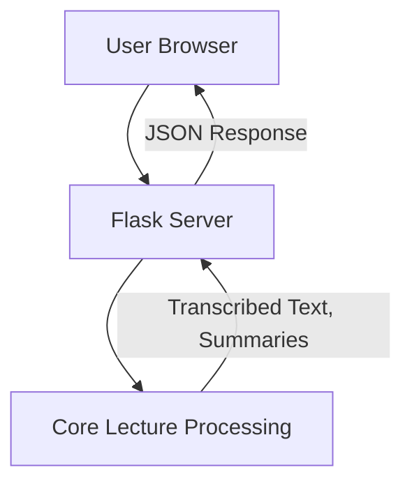

# Note-Summerizer — Repository Overview

### High-Level Purpose
The Note-Summerizer system is an AI-powered web application designed to process lecture content from various audio input sources (microphone recording, local audio files, or YouTube video URLs). Its primary objective is to transcribe the audio, generate concise summaries and key points using a pre-trained language model, and allow users to export these processed insights into multiple formats like PDF, Word, or JSON.

### Architectural Structure
The system employs a client-server architecture. The frontend, composed of `index.html`, `style.css`, and `script.js`, runs in the user's browser, providing the user interface and handling client-side logic. The backend, implemented in Python, consists of a Flask web server (`server.py`) that exposes an API endpoint. This server acts as an orchestrator, delegating core audio processing and natural language understanding tasks to a dedicated, monolithic processing module (`lecture4.py`).

### Core Components
*   **Client User Interface (HTML, CSS, JavaScript)**:
    *   `index.html`: Defines the foundational structure of the web page, including input forms, display areas for summaries, and links to styling and scripts.
    *   `style.css`: Manages the visual presentation, layout, responsive design, and a dark/light theming system for all UI elements.
    *   `script.js`: Implements client-side interactivity, input validation, form submission to the backend, dynamic display of processing messages and results in a chat-like interface, and theme persistence.
*   **Backend API Server (`server.py`)**:
    *   A Flask application that provides a `/summarize` POST endpoint.
    *   Responsible for receiving user requests, parsing input parameters (source type, export format, audio source), securely handling temporary file uploads, and returning processed data as JSON.
    *   Acts as an intermediary, invoking the `lecture4.process_input` function to perform the core logic.
*   **Core Lecture Processing Module (`lecture4.py`)**:
    *   Encapsulates end-to-end functionality for audio handling, transcription, NLP, and document generation.
    *   Handles audio recording (microphone), downloading YouTube audio, transcribing audio to text (Whisper model), chunking long texts for LLM processing, generating summaries and key points (Hugging Face `google/flan-t5-large` model), and exporting results to PDF, Word, or JSON formats.

### Interaction & Data Flow
1.  A user interacts with the web interface loaded from `index.html`.
2.  `script.js` captures user input (source type, YouTube URL, local file, or microphone duration) and desired export format from the `promptForm`.
3.  Upon form submission, `script.js` performs client-side validation and sends a `POST` request with `FormData` to the `/summarize` endpoint on the `server.py` Flask application.
4.  `server.py` receives the request. If an audio file is uploaded, it's temporarily saved. `server.py` then calls `lecture4.process_input`, passing the necessary parameters (e.g., file path, YouTube URL, duration).
5.  `lecture4.py` acquires the audio (records, loads, or downloads), transcribes it to text, processes the text to generate summaries and key points, and creates the specified export file.
6.  The processed results (summary, overview, key points, and export file path) are returned from `lecture4.py` to `server.py`.
7.  `server.py` packages these results (or an error message) into a JSON response and sends it back to `script.js`.
8.  `script.js` receives the JSON response, clears any processing messages, and dynamically renders the summary, key points, and export information in the `chats-container` on the user's interface.

### Technology Stack
*   **Frontend**: HTML, CSS, JavaScript (Fetch API, DOM manipulation, `localStorage`).
*   **Backend**: Python, Flask, Flask-CORS, `werkzeug.utils.secure_filename`.
*   **Audio Processing & NLP**:
    *   OpenAI `whisper` for speech-to-text transcription.
    *   Hugging Face `transformers` library, utilizing the `google/flan-t5-large` model for summarization and key point generation.
    *   `yt_dlp` for downloading audio from YouTube.
    *   `sounddevice` and `scipy.io.wavfile` for microphone audio recording.
*   **Document Generation**: `fpdf` for PDF export, `docx` for Word document export.
*   **Utilities**: `os` for file system operations, `json` for data serialization.

### Design Observations
*   **Modular Backend Processing**: The `lecture4.py` file centralizes all core processing logic, making it a self-contained unit for audio handling, NLP, and document generation.
*   **Client-Side Responsiveness**: `script.js` provides dynamic UI updates, input validation, and theme toggling, enhancing user experience. `style.css` ensures responsive design across devices and offers a theming system via CSS custom properties.
*   **Temporary File Management**: The `server.py` and `lecture4.py` modules actively manage temporary audio files, ensuring they are deleted after processing to prevent disk space accumulation.
*   **LLM Context Management**: The `chunk_text` function in `lecture4.py` is a critical design element, enabling the processing of long lecture transcripts by segmenting them into manageable sizes for the language model.
*   **Development-Oriented**: The Flask server runs in debug mode, and error handling is somewhat generic, indicating a primary focus on functionality and rapid development. Further hardening would be required for production environments.

### System Diagram (Optional)
