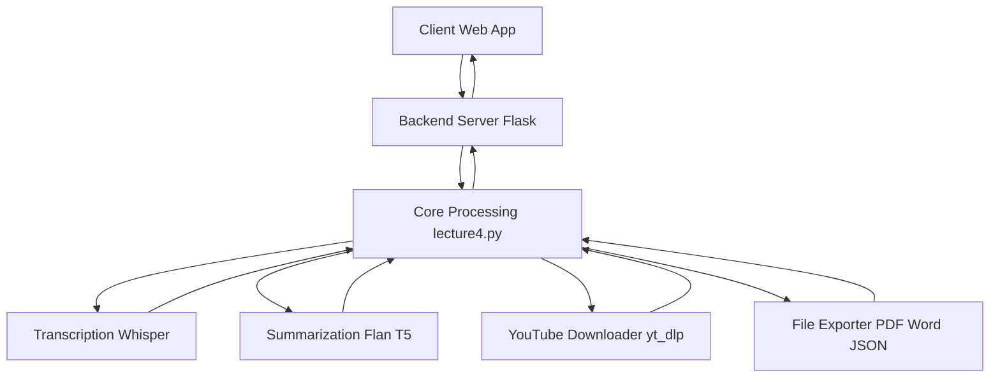

# Note-Summerizer — Repository Overview

### High-Level Purpose
The Note-Summerizer repository provides an AI-powered web application designed to transcribe, summarize, and extract key points from various audio and video lecture sources. It supports input from microphones, local audio/video files, and YouTube URLs, allowing users to export the generated summaries into PDF, Word, or JSON formats.

### Architectural Structure
The system employs a client-server architecture with a clear separation between the frontend user interface and a Python-based backend.

*   **Client-Side (Frontend)**: Resides in the browser, built with standard web technologies.
    *   `index.html`: The main entry point, defining the overall UI structure, static content, and linking to client-side resources.
    *   `style.css`: Manages the application's visual presentation, including layout, typography, theming (dark/light mode), and responsiveness.
    *   `script.js`: Handles all client-side logic, user interactions, form validation, asynchronous communication with the backend API, and dynamic updating of the UI.
*   **Server-Side (Backend)**: A Python Flask application responsible for processing requests and orchestrating core functionalities.
    *   `server.py`: Implements the RESTful API endpoint, receives client requests, manages file uploads, and delegates processing tasks.
    *   `lecture4.py`: Contains the core business logic, including audio recording, transcription, text chunking, summarization using NLP models, key point extraction, and various document export functionalities.
*   **Data Storage**:
    *   Temporary `uploads/` directory on the server for uploaded files.
    *   Browser `localStorage` for client-side theme preferences.

### Core Components
*   **Web User Interface**: The combination of `index.html`, `style.css`, and `script.js` provides the interactive frontend. It allows users to select input types, submit content, and view summarization results in a chat-like format.
*   **Flask API Server**: `server.py` acts as the intermediary, exposing a `/summarize` endpoint to the client. It handles incoming POST requests, parses parameters, manages temporary file storage, and dispatches tasks to the processing engine.
*   **Core Summarization Engine**: Encapsulated within `lecture4.py`, this component integrates:
    *   **Audio/Video Input Handling**: Functions for recording microphone audio, processing local files, and downloading/transcribing YouTube content.
    *   **Transcription Module**: Utilizes the Whisper model for converting audio to text.
    *   **Natural Language Processing (NLP) Module**: Leverages a Hugging Face `transformers` summarization pipeline (specifically `google/flan-t5-large`) for generating overall summaries, brief overviews, and key points.
    *   **Document Export Module**: Generates output in PDF, Word, or JSON formats.

### Interaction & Data Flow
1.  A user interacts with the web application in their browser, selecting an input type (microphone, file, YouTube link) and an export format through the UI managed by `index.html` and `script.js`.
2.  Upon form submission, `script.js` validates the input, constructs a `FormData` object, displays a "Processing Input..." message, and sends an asynchronous POST request to the `server.py` `/summarize` endpoint.
3.  `server.py` receives the request. If a file is uploaded, it's saved to a temporary `uploads/` directory. Based on the `input_type` (mic, file, youtube), `server.py` calls the `process_input` function in `lecture4.py`.
4.  `lecture4.py` then executes the full summarization workflow:
    *   Acquires content (records audio, loads file, or downloads YouTube audio).
    *   Transcribes the audio into text using the Whisper model.
    *   Chunks the transcribed text to handle model token limits.
    *   Generates an overall summary, overview, and key points using the Flan-T5 summarization model.
    *   Exports the results into the specified PDF, Word, or JSON file.
    *   Cleans up any temporary audio files.
5.  `lecture4.py` returns the processing results (summary, key points, output file path) to `server.py`.
6.  `server.py` formats these results into a JSON response and sends it back to `script.js`.
7.  `script.js` receives the JSON response, removes the processing message, and dynamically updates the `chats-container` to display the generated summaries and key points to the user. Errors at any stage are caught and displayed to the user.

### Technology Stack
*   **Frontend**: HTML, CSS, JavaScript (Vanilla, `fetch` API, `localStorage`).
*   **Backend**: Python, Flask, Flask-CORS.
*   **NLP/AI**: Hugging Face `transformers` library (`google/flan-t5-large` model), OpenAI Whisper.
*   **Audio Processing**: `sounddevice`, `scipy.io.wavfile`, `yt_dlp` (YouTube download).
*   **Document Generation**: `fpdf` (PDF), `python-docx` (Word), `json`.
*   **Utility**: `os` (file system operations), `werkzeug.utils.secure_filename` (filename sanitization).

### Design Observations
*   **Modularity**: The system broadly separates presentation (frontend), API handling (Flask server), and core business logic (processing engine). This enhances maintainability and allows for independent development of these layers.
*   **Theming and Responsiveness**: The frontend employs CSS custom properties for efficient theme management (dark/light mode) and media queries for responsive design, ensuring usability across various device sizes.
*   **Temporary Resource Management**: The backend diligently handles temporary file uploads and audio recordings, ensuring cleanup after processing to prevent resource accumulation.
*   **Error Handling**: Basic `try-except` blocks are implemented across both the client and server to provide feedback to the user and log issues.
*   **NLP Model Integration**: The core `lecture4.py` effectively integrates external NLP models (Whisper, Flan-T5) and handles their input constraints (e.g., text chunking for token limits).
*   **Monolithic Processing Logic**: `lecture4.py` is a self-contained script encompassing all steps from input acquisition to output generation. While this simplifies deployment for a utility, it could benefit from further decomposition into smaller, more reusable modules for larger-scale applications.
*   **Incomplete Microphone Integration**: The frontend `script.js` includes UI and data structures for microphone input, but the actual client-side audio capture logic is not fully present or functional.

### System Diagram
