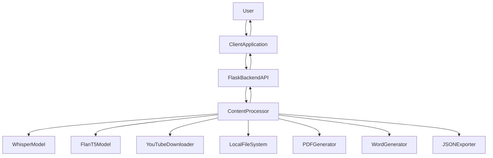

# Note-Summerizer — Repository Overview

### High-Level Purpose
The Note-Summerizer system provides a web-based application for transcribing audio content from various sources (live microphone, local audio files, or YouTube links), generating an overall summary and key points from the transcribed text, and exporting these results into multiple document formats such as PDF, Word, or JSON.

### Architectural Structure
The system follows a classic client-server architecture with a distinct processing layer.
*   **Client-side (Frontend)**: Consists of `index.html` (structure), `style.css` (presentation), and `script.js` (interactive logic). This layer handles user input, displays results, and manages UI state.
*   **Server-side (Backend)**: Implemented with Flask (`server.py`), providing a RESTful API endpoint (`/summarize`) that acts as the communication interface between the client and the core processing logic.
*   **Core Processing Layer**: A dedicated Python module (`lecture4.py`) that encapsulates the complex operations of audio acquisition, speech-to-text transcription, NLP-based summarization, and document generation.
*   **Asset & Temporary Storage**: Includes a directory for static video assets (`videos/`) and a temporary upload folder (`uploads/`) for handling incoming files.

### Core Components
*   **Web User Interface**: The browser-based application (`index.html`, `style.css`, `script.js`) responsible for collecting user input (source type, file/URL, export format) and dynamically displaying the summarization results.
*   **Flask Backend API (`server.py`)**: A Flask application that exposes a `/summarize` POST endpoint. It handles client requests, performs basic input validation, manages file uploads and cleanup, and delegates the core processing tasks.
*   **Content Processing Engine (`lecture4.py`)**: The central logic unit that:
    *   Acquires audio from a microphone, local file, or by downloading YouTube audio.
    *   Transcribes audio into text using the `whisper` library.
    *   Generates text summaries and key points using a Hugging Face `transformers` model (`google/flan-t5-large`).
    *   Exports the processed information into PDF (`fpdf`), Word (`python-docx`), or JSON formats.

### Interaction & Data Flow
1.  A user interacts with the web application's frontend to specify an audio input source (microphone, file upload, or YouTube URL) and a desired output format.
2.  Upon form submission, `script.js` constructs `FormData` and sends an asynchronous POST request to the `/summarize` endpoint of the Flask backend (`server.py`).
3.  `server.py` receives the request. If an audio file is uploaded, it's securely saved to a temporary `uploads` directory. The backend then invokes the `process_input` function within `lecture4.py`, passing the relevant parameters (source type, path/URL, export format, duration).
4.  `lecture4.py` executes the core workflow: it records or downloads the audio, transcribes it to text, applies text chunking if necessary, generates an overall summary and key points, and creates the output file in the specified format.
5.  `lecture4.py` returns the generated summary, overview, key points, and output file path to `server.py`, which also handles the deletion of temporary uploaded files.
6.  `server.py` serializes these results into a JSON response and sends it back to `script.js`.
7.  `script.js` parses the JSON response and updates the UI to display the generated summary and key points in a chat-like interface.

### Technology Stack
*   **Frontend**: HTML5, CSS3, JavaScript. Uses Google Fonts (Material Symbols Rounded, Poppins) for typography and icons.
*   **Backend Framework**: Python with Flask.
*   **CORS Management**: Flask-CORS.
*   **Speech-to-Text**: `whisper` library (utilizing the "medium" model).
*   **Natural Language Processing (NLP)**: Hugging Face `transformers` library, specifically the `google/flan-t5-large` model for text summarization and key point extraction.
*   **Audio I/O**: `sounddevice` and `scipy.io.wavfile` for microphone recording and WAV file handling.
*   **Video/Audio Downloading**: `yt-dlp` for extracting audio streams from YouTube URLs.
*   **Document Generation**: `fpdf` for PDF output and `python-docx` for Microsoft Word documents. JSON output uses Python's built-in `json` module.
*   **Utilities**: `os` for file system operations, `werkzeug.utils.secure_filename` for secure file upload handling.

### Design Observations
*   **Clear Separation of Concerns**: The architecture cleanly delineates between the presentation layer (frontend), the API gateway (Flask backend), and the core processing logic (`lecture4.py`). This promotes maintainability and allows for independent development and scaling of each layer.
*   **Monolithic Processing Module**: While `lecture4.py` effectively orchestrates complex tasks, it consolidates diverse functionalities (audio acquisition, transcription, ML inference, document generation) into a single module. Future enhancements might benefit from further modularizing these sub-components for improved testability and flexibility.
*   **Robust File Handling**: The system incorporates secure file handling for user uploads via `werkzeug.utils.secure_filename` and ensures prompt cleanup of temporary files, which is critical for security and resource management.
*   **User Experience Focus**: The frontend includes features like dynamic input field visibility, a dark/light theme toggle with local storage persistence, and real-time feedback during processing, enhancing the user experience.
*   **Hardcoded Backend Endpoint**: The client-side JavaScript hardcodes the backend API URL, which would require manual modification for deployment in different environments (e.g., development, staging, production). Externalizing this configuration would improve deployment flexibility.

### System Diagram

```mermaid
graph TD
User[User] --> ClientApplication[ClientApplication]
ClientApplication --> FlaskBackendAPI[FlaskBackendAPI]
FlaskBackendAPI --> ContentProcessor[ContentProcessor]

ContentProcessor --> WhisperModel[WhisperModel]
ContentProcessor --> FlanT5Model[FlanT5Model]
ContentProcessor --> YouTubeDownloader[YouTubeDownloader]
ContentProcessor --> LocalFileSystem[LocalFileSystem]
ContentProcessor --> PDFGenerator[PDFGenerator]
ContentProcessor --> WordGenerator[WordGenerator]
ContentProcessor --> JSONExporter[JSONExporter]

ContentProcessor --> FlaskBackendAPI
FlaskBackendAPI --> ClientApplication
ClientApplication --> User
```