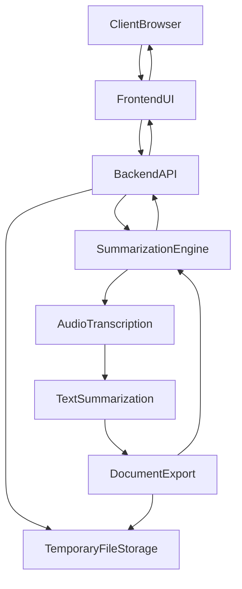

# Note-Summerizer — Repository Overview

### High-Level Purpose
The Note-Summerizer system provides a web-based interface for processing audio and video content to generate summaries and key points. It supports various input sources, including microphone audio, local audio files, and YouTube URLs. The processed information can then be exported into PDF, Word, or JSON formats, and presented in a chat-like interface. Its primary objective is to facilitate the efficient summarization of lectures or notes.

### Architectural Structure
The system employs a client-server architecture. The frontend, composed of static web assets and client-side JavaScript, handles user interaction and communicates with a Python-based backend. The backend exposes a RESTful API endpoint, which in turn orchestrates a monolithic Python script containing the core summarization and document generation logic. This structure separates presentation from business logic and data processing.

### Core Components
*   **Frontend User Interface (`index.html`, `style.css`, `script.js`)**: Provides the interactive web application. `index.html` defines the page structure, `style.css` controls visual presentation, and `script.js` manages user input, communicates with the backend, and dynamically displays results.
*   **Backend API (`server.py`)**: A Flask application that serves as the entry point for client requests. It manages input reception, temporary file handling, and delegates core processing tasks to the summarization engine.
*   **Summarization Engine (`lecture4.py`)**: A self-contained Python module responsible for the entire processing workflow. This includes audio recording, YouTube content download, speech-to-text transcription (using Whisper), text summarization and key point extraction (using a Hugging Face `transformers` model like Flan-T5), and exporting results into PDF, Word, or JSON documents.

### Interaction & Data Flow
1.  A user interacts with the `FrontendUI` to select an input source (microphone, local file, or YouTube URL) and an export format.
2.  `script.js` captures this input, constructs a `FormData` object, and sends an asynchronous HTTP POST request to the `/summarize` endpoint exposed by `BackendAPI`.
3.  `BackendAPI` receives the request. If a file is uploaded, it is saved temporarily. `BackendAPI` then calls the `process_input` function within the `SummarizationEngine` with the appropriate parameters.
4.  The `SummarizationEngine` executes the core workflow:
    *   Acquires audio content based on the input source (records, loads, or downloads from YouTube).
    *   Transcribes the audio into text using `AudioTranscription`.
    *   Processes the text by chunking it and utilizing `TextSummarization` to generate an overall summary, a brief overview, and key points.
    *   Uses `DocumentExport` to create the final output file (PDF, Word, or JSON) based on the requested format, potentially storing it temporarily.
    *   Cleans up any intermediate temporary audio files.
5.  The `SummarizationEngine` returns the processed summaries, key points, and output file path to the `BackendAPI`.
6.  `BackendAPI` formats this information into a JSON response and sends it back to the `FrontendUI`.
7.  `FrontendUI` receives the response, clears any processing messages, and dynamically displays the generated summaries and key points in the chat-like interface.

### Technology Stack
*   **Frontend**: HTML5, CSS3, JavaScript (ES6+), Google Fonts, Material Symbols.
*   **Backend**: Python 3.x, Flask, Flask-CORS, `werkzeug.utils`.
*   **Core Processing**: Python 3.x, `transformers` (Hugging Face `google/flan-t5-large`), `whisper` (speech-to-text), `yt_dlp` (YouTube download), `sounddevice` (microphone input), `scipy.io.wavfile` (WAV file handling), `fpdf` (PDF generation), `docx` (Word document generation), `os`, `json`.

### Design Observations
*   **Monolithic Core Logic**: The `lecture4.py` script combines multiple stages of audio processing, NLP, and document generation into a single module. This design simplifies initial development and deployment but may impact modularity, independent testing, and scalability of individual components.
*   **Client-Server Decoupling**: The clear separation between the browser-based frontend and the Python backend allows for independent development, deployment, and potential scaling of each layer.
*   **Temporary Resource Management**: The backend and core processing logic explicitly handle the creation and deletion of temporary files (uploaded audio, downloaded YouTube content, generated output), which is critical for resource efficiency and security.
*   **Flexible Input Handling**: The system supports a variety of input sources, providing convenience and broader applicability for users.
*   **Theming**: Client-side theme switching with `localStorage` persistence and CSS variables provides a user-friendly and easily maintainable approach to UI customization.
*   **Development-Oriented Setup**: The Flask server configuration (`debug=True`) is suitable for development environments, but would require adjustments (e.g., a production-ready WSGI server and `debug=False`) for production deployment.

### System Diagram

```mermaid
graph TD
ClientBrowser[ClientBrowser] --> FrontendUI[FrontendUI];
FrontendUI --> BackendAPI[BackendAPI];
BackendAPI --> TemporaryFileStorage[TemporaryFileStorage];
BackendAPI --> SummarizationEngine[SummarizationEngine];
SummarizationEngine --> AudioTranscription[AudioTranscription];
AudioTranscription --> TextSummarization[TextSummarization];
TextSummarization --> DocumentExport[DocumentExport];
DocumentExport --> TemporaryFileStorage;
DocumentExport --> SummarizationEngine;
SummarizationEngine --> BackendAPI;
BackendAPI --> FrontendUI;
FrontendUI --> ClientBrowser;
```