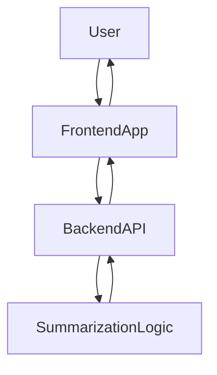

# REPOSITORY_OVERVIEW.md

> **Source File:** [REPOSITORY_OVERVIEW.md](https://github.com/test-company-prowiz/Note-Summerizer/blob/main/REPOSITORY_OVERVIEW.md)
> **Repository:** `Note-Summerizer`
> **Branch:** `main`

# Note-Summerizer — Repository Overview

### High-Level Purpose
The Note-Summerizer repository provides a web application designed to summarize various forms of content, including YouTube videos and audio files. Its primary objective is to process user-provided inputs and present concise summaries, key points, and overviews.

### Architectural Structure
The system employs a client-server architecture with a clear separation between the frontend and backend components.
*   **Client-Side (Frontend)**: Implemented in `script.js`, responsible for the user interface, input handling, and interacting with the backend API.
*   **Server-Side (Backend)**: Implemented in `server.py`, acting as an API gateway built with Flask, handling requests, orchestrating summarization logic, and returning results.
*   **Core Logic Module**: An external Python module (`lecture4`) is integrated into the backend to perform the actual summarization tasks.

### Core Components
*   **`script.js`**: The client-side JavaScript application managing UI interactions, form submissions, theme toggling, and displaying summarization results.
*   **`server.py`**: The Flask backend API, responsible for:
    *   Exposing the `/summarize` endpoint.
    *   Receiving and parsing client requests.
    *   Handling file uploads (saving and deleting temporary files).
    *   Invoking the core summarization logic.
    *   Returning structured JSON responses.
*   **`lecture4.process_input`**: An internal Python function (imported by `server.py`) that encapsulates the core business logic for processing different input types (YouTube URLs, audio files, microphone input) and generating summaries.

### Interaction & Data Flow
1.  A user interacts with the web frontend (`script.js`) by selecting an input type (YouTube URL or audio file) and submitting a request.
2.  `script.js` validates the input, constructs a `FormData` object, and sends an asynchronous `POST` request to the backend's `/summarize` API endpoint.
3.  The `server.py` Flask application receives the request, identifies the `input_type`, and extracts relevant data (e.g., YouTube URL, uploaded file).
4.  For file uploads, `server.py` securely saves the file temporarily, then invokes the `lecture4.process_input` function with the appropriate source type and parameters.
5.  The `lecture4.process_input` module processes the input (e.g., transcribes audio, extracts YouTube content) and generates the summary.
6.  The summarization results are returned to `server.py`.
7.  `server.py` formats the results (or any errors) into a JSON response and sends it back to the client.
8.  `script.js` receives the JSON response, parses it, and dynamically updates the UI to display the generated summary, overview, and key points.

### Technology Stack
*   **Frontend**: JavaScript (ES6+), HTML, CSS. Utilizes standard Web APIs like `fetch`, `FormData`, `localStorage`, and direct DOM manipulation.
*   **Backend**: Python 3.x.
    *   **Web Framework**: Flask.
    *   **CORS**: `flask_cors`.
    *   **File Handling**: `os`, `werkzeug.utils.secure_filename`.
*   **Core Logic**: Python (via the `lecture4` module).

### Design Observations
*   **Clear API Boundary**: The client-side `script.js` interacts with the backend `server.py` exclusively via a single, well-defined API endpoint (`/summarize`), simplifying communication.
*   **Input Type Flexibility**: The backend design accommodates various input sources (YouTube, file, microphone) through a unified `process_input` function and an `input_type` parameter.
*   **Temporary File Management**: The backend handles file uploads by saving them temporarily and ensuring their deletion after processing, minimizing resource usage.
*   **Cross-Origin Support**: CORS is enabled on the backend, facilitating development and deployment where frontend and backend might operate on different origins.
*   **Modularity**: The core summarization logic is encapsulated in a separate `lecture4` module, promoting separation of concerns and potential for reuse or independent development.

### System Diagram

```mermaid
graph TD
A[User] --> B[FrontendApp]
B --> C[BackendAPI]
C --> D[SummarizationLogic]
D --> C
C --> B
B --> A
```