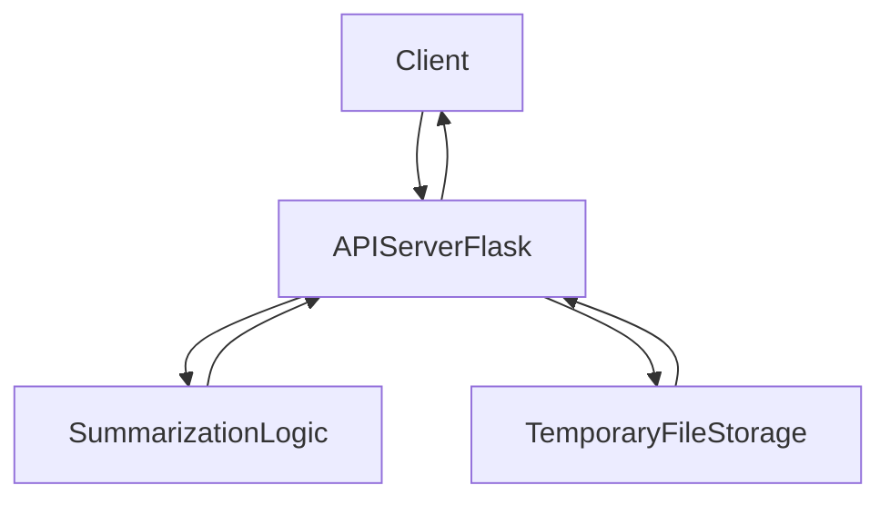

# Note-Summerizer — Repository Overview

### High-Level Purpose
The repository implements a service for generating summaries from diverse input sources, including uploaded files, YouTube URLs, and microphone audio. Its primary objective is to provide an API endpoint that orchestrates input processing and summarization.

### Architectural Structure
The system follows a client-server architecture. `server.py` establishes the backend API layer, acting as an entry point for client requests. It delegates core business logic, such as input processing and summarization, to an internal module (`lecture4`). The application uses a designated `UPLOAD_FOLDER` for temporary file storage, indicating interaction with the local file system.

### Core Components
-   **API Server (`server.py`)**: A Flask-based web server responsible for exposing the `/summarize` API endpoint, handling HTTP requests, managing file uploads, and orchestrating calls to the core summarization logic.
-   **Summarization Logic (`lecture4.process_input`)**: An internal module that encapsulates the business logic for processing different input types (file content, YouTube audio, microphone audio) and generating summaries.

### Interaction & Data Flow
1.  A client initiates a POST request to the `/summarize` endpoint, specifying an `input_type` (file, youtube, mic) and relevant data.
2.  The API server (`server.py`) receives the request.
3.  If `input_type` is "file", the server saves the uploaded file temporarily.
4.  The server then invokes the `process_input` function from the `lecture4` module, passing the appropriate input (file path, YouTube URL, or duration).
5.  The `process_input` function performs the summarization.
6.  The summarization result is returned to the server.
7.  The server constructs a JSON response, handling any errors, and sends it back to the client.
8.  Temporary files are cleaned up after processing.

### Technology Stack
-   **Web Framework**: Flask
-   **CORS**: Flask-CORS
-   **File Handling**: `os` module, `werkzeug.utils.secure_filename`

### Design Observations
The system centralizes various summarization input types under a single API endpoint, leveraging a parameter to differentiate processing paths. This simplifies the API surface for clients. Temporary file handling is explicitly managed, ensuring cleanup. Global CORS enablement facilitates frontend integration, though a production environment might require more restrictive policies. Error handling is implemented to provide informative responses with appropriate HTTP status codes.

### System Diagram

```mermaid
graph TD
Client --> APIServer[APIServerFlask]
APIServer --> SummarizationLogic[SummarizationLogic]
APIServer --> TemporaryFileStorage[TemporaryFileStorage]
TemporaryFileStorage --> APIServer
SummarizationLogic --> APIServer
APIServer --> Client
```