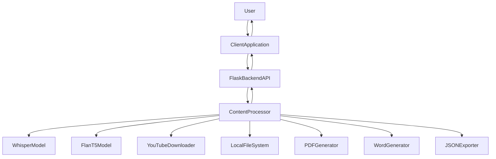

# Note-Summerizer — Repository Overview

### High-Level Purpose
The Note-Summerizer system provides a web-based application for transcribing audio content from various sources (live microphone, local audio files, or YouTube links). It then generates an overall summary and key points from the transcribed text, with the capability to export these results into multiple document formats such as PDF, Word, or JSON.

### Architectural Structure
The system employs a classic client-server architecture complemented by a dedicated processing layer.
*   **Client-side (Frontend)**: Comprises `index.html`, `style.css`, and `script.js`, responsible for user interface, interaction, and presentation.
*   **Server-side (Backend)**: Implemented with Flask (`server.py`), providing a RESTful API to mediate between the client and core processing logic.
*   **Core Processing Layer**: A Python module (`lecture4.py`) that encapsulates all complex operations including audio handling, speech-to-text, natural language processing for summarization, and document generation.
*   **Asset & Temporary Storage**: Includes a directory for static video assets (`videos/`) and a temporary `uploads/` folder for handling client-submitted files.

### Core Components
*   **Web User Interface**: The browser-based application responsible for user input collection (source type, file/URL, export format) and dynamic display of summarization results.
*   **Flask Backend API (`server.py`)**: Manages client requests, handles secure file uploads, performs input validation, and orchestrates calls to the core content processing engine.
*   **Content Processing Engine (`lecture4.py`)**: The central component for audio acquisition (microphone, local file, YouTube), `whisper`-based speech-to-text transcription, `flan-t5-large`-based text summarization and key point extraction, and multi-format document generation (PDF, Word, JSON).

### Interaction & Data Flow
1.  A user selects an audio input source (microphone, file, or YouTube URL) and an output format via the client-side web application.
2.  `script.js` captures user input, constructs a `FormData` object, and sends an asynchronous POST request to the Flask backend's `/summarize` endpoint.
3.  `server.py` receives the request, processes any uploaded files (saving them temporarily), and invokes `lecture4.py`'s `process_input` function with the relevant source information and desired export format.
4.  `lecture4.py` executes the full summarization workflow: audio acquisition, transcription, text summarization, key point extraction, and output file generation. Temporary audio files are cleaned up.
5.  `lecture4.py` returns the summary, overview, key points, and the path to the generated output file to `server.py`.
6.  `server.py` serializes this information into a JSON response and sends it back to `script.js`.
7.  `script.js` parses the JSON, updates the UI to display the results, and provides a link for the generated output file.

### Technology Stack
*   **Frontend**: HTML5, CSS3, JavaScript. Integrates Google Fonts (Material Symbols Rounded, Poppins).
*   **Backend Framework**: Python with Flask.
*   **CORS Management**: Flask-CORS.
*   **Speech-to-Text**: `whisper` library ("medium" model).
*   **Natural Language Processing**: Hugging Face `transformers` library (`google/flan-t5-large` model).
*   **Audio I/O**: `sounddevice`, `scipy.io.wavfile`.
*   **Video/Audio Downloading**: `yt-dlp`.
*   **Document Generation**: `fpdf` (PDF), `python-docx` (Word), `json` (JSON).
*   **Utilities**: `os`, `werkzeug.utils.secure_filename`.

### Design Observations
*   **Clear Separation of Concerns**: The architecture maintains a distinct division between the client (UI), backend API, and core processing logic, which aids maintainability and modularity.
*   **Centralized Processing Logic**: `lecture4.py` consolidates diverse functionalities (audio, ML, document generation), which simplifies the workflow orchestration but could be further modularized for enhanced testability and independent scaling of sub-components.
*   **Secure File Handling**: The backend implements secure file upload mechanisms using `werkzeug.utils.secure_filename` and ensures temporary file cleanup, addressing key security and resource management considerations.
*   **User Experience Focus**: The frontend includes features like dynamic input field visibility, theme switching with persistence, and real-time feedback, contributing to a user-friendly interface.
*   **Hardcoded Backend Endpoint**: The frontend JavaScript hardcodes the backend API URL, which necessitates manual updates for different deployment environments. Externalizing this configuration would improve deployment flexibility.

### System Diagram

```mermaid
graph TD
User[User] --> ClientApplication[ClientApplication]
ClientApplication --> FlaskBackendAPI[FlaskBackendAPI]
FlaskBackendAPI --> ContentProcessor[ContentProcessor]

ContentProcessor --> WhisperModel[WhisperModel]
ContentProcessor --> FlanT5Model[FlanT5Model]
ContentProcessor --> YouTubeDownloader[YouTubeDownloader]
ContentProcessor --> LocalFileSystem[LocalFileSystem]
ContentProcessor --> PDFGenerator[PDFGenerator]
ContentProcessor --> WordGenerator[WordGenerator]
ContentProcessor --> JSONExporter[JSONExporter]

ContentProcessor --> FlaskBackendAPI
FlaskBackendAPI --> ClientApplication
ClientApplication --> User
```