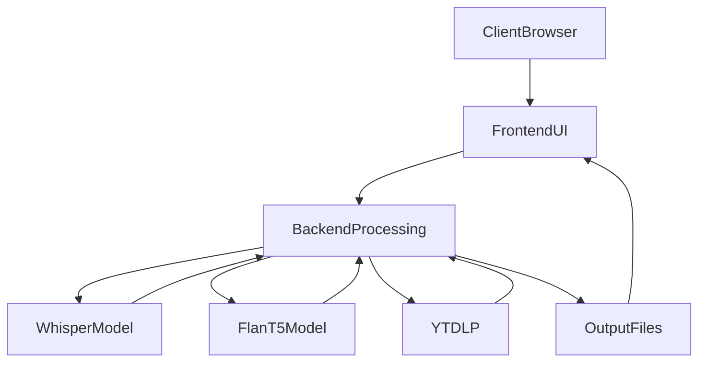

# REPOSITORY_OVERVIEW.md

> **Source File:** [REPOSITORY_OVERVIEW.md](https://github.com/test-company-prowiz/Note-Summerizer/blob/main/REPOSITORY_OVERVIEW.md)
> **Repository:** `Note-Summerizer`
> **Branch:** `main`

# Note-Summerizer — Repository Overview

### High-Level Purpose
The Note-Summerizer repository aims to provide an AI-powered application for summarizing lecture content. It processes audio inputs from various sources (microphone, local files, YouTube links), transcribes them, generates concise summaries and key points, and allows users to export the results into multiple document formats.

### Architectural Structure
The repository demonstrates a two-tier architectural structure:
*   **Presentation Layer**: Comprises `index.html` and its associated `style.css` and `script.js` files, forming the client-side user interface.
*   **Processing Layer**: `lecture4.py` represents the backend logic responsible for audio handling, transcription, natural language processing (NLP) for summarization and key point extraction, and document generation.

The `index.html` file serves as the static entry point for the web application, while `lecture4.py` encapsulates the core, resource-intensive processing capabilities, implying a client-server interaction model for a complete deployment.

### Core Components
*   **User Interface (`index.html`, `script.js`, `style.css`)**: Provides the interactive web interface for users to select input sources, initiate summarization, and choose export formats.
*   **Audio Input Handler (`lecture4.py`)**: Manages recording from a microphone, processing local audio/video files, and downloading audio from YouTube URLs.
*   **Transcription Engine (`lecture4.py`)**: Utilizes the Whisper model for converting spoken audio into text.
*   **Summarization and Key Point Generation (`lecture4.py`)**: Leverages the Hugging Face `transformers` library with the Flan-T5 model to create summaries and extract key points from transcribed text.
*   **Document Export (`lecture4.py`)**: Supports exporting processed summaries and key points into PDF, Microsoft Word (`.docx`), and JSON formats.

### Interaction & Data Flow
A user interacts with the web interface (`index.html`), selecting an input source (mic, file, YouTube URL) and an export format. User actions on the frontend (presumably handled by `script.js`) would trigger requests to a backend service. This backend service, implemented by `lecture4.py`, would then:
1.  Acquire audio data based on the user's input choice.
2.  Transcribe the audio into text.
3.  Process the text to generate summaries and key points.
4.  Format the results into the requested export type.
5.  Return the output (e.g., file path, JSON data) to the frontend for download or display.
Temporary audio files are created and cleaned up during the backend processing.

### Technology Stack
*   **Frontend**: HTML5, CSS3, JavaScript (implied by `script.js`), Google Fonts.
*   **Backend/Processing**: Python.
*   **Speech-to-Text**: OpenAI Whisper (via `whisper` library).
*   **Natural Language Processing**: Hugging Face `transformers` library (specifically `google/flan-t5-large` for summarization).
*   **Audio Handling**: `sounddevice`, `scipy.io.wavfile` for microphone recording; `yt_dlp` for YouTube audio download.
*   **Document Generation**: `fpdf` for PDF, `python-docx` for Word.
*   **Data Serialization**: `json`.
*   **File System Operations**: `os`.

### Design Observations
The project demonstrates a clear separation of concerns between the user interface and the core processing logic. The `lecture4.py` module is highly modular, breaking down complex tasks like transcription, summarization, and export into distinct functions, which enhances maintainability and reusability. The selection of established NLP models (Whisper, Flan-T5) indicates a focus on leveraging robust, pre-trained solutions for accuracy. The provision of multiple export formats caters to diverse user requirements. The `index.html` disclaimer about "limited AI logic" for the demo suggests that while the `lecture4.py` provides full functionality, the frontend might initially demonstrate a simplified client-side AI integration or act as a placeholder for a full backend connection.

### System Diagram

```mermaid
graph TD
A[ClientBrowser] --> B[FrontendUI]
B[FrontendUI] --> C[BackendProcessing]
C[BackendProcessing] --> D[WhisperModel]
C[BackendProcessing] --> E[FlanT5Model]
C[BackendProcessing] --> F[YTDLP]
C[BackendProcessing] --> G[OutputFiles]
D[WhisperModel] --> C
E[FlanT5Model] --> C
F[YTDLP] --> C
G[OutputFiles] --> B
```