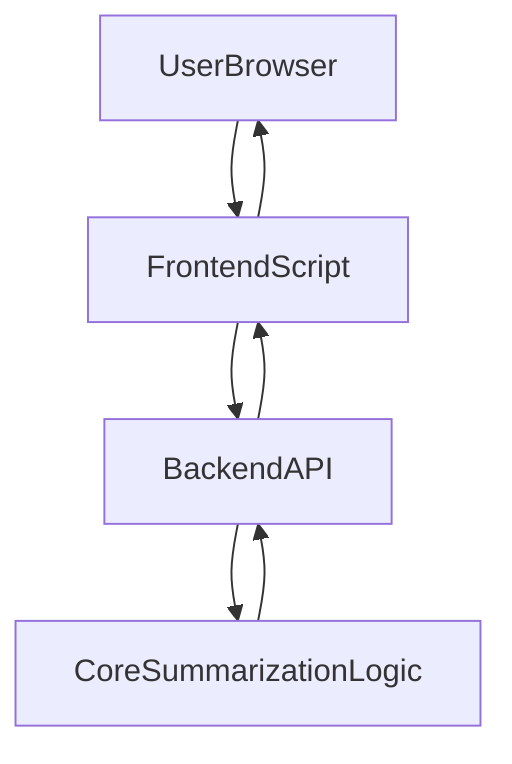

# REPOSITORY_OVERVIEW.md

> **Source File:** [REPOSITORY_OVERVIEW.md](https://github.com/test-company-prowiz/Note-Summerizer/blob/main/REPOSITORY_OVERVIEW.md)
> **Repository:** `Note-Summerizer`
> **Branch:** `main`

# Note-Summerizer — Repository Overview

### High-Level Purpose
The Note-Summerizer repository provides a web application designed to summarize content from various input sources. Its primary objective is to allow users to submit YouTube links, audio files, or microphone input, process this content, and return a structured summary.

### Architectural Structure
The repository is structured into a client-side frontend and a Python-based backend API.
*   **Frontend**: Implemented in `script.js`, it handles user interface interactions, input collection, and display of results within the browser.
*   **Backend**: Implemented in `server.py` using Flask, it exposes a `/summarize` API endpoint to receive requests, manage file uploads, and orchestrate the core summarization logic.
*   **Core Logic**: A separate module, `lecture4.py` (inferred from `server.py`'s dependency), encapsulates the actual summarization algorithms and processing for different input types.

### Core Components
*   **Client-Side Application (`script.js`)**: Manages the web UI, form submissions, dynamic content rendering, and asynchronous communication with the backend.
*   **Flask API Server (`server.py`)**: Acts as the HTTP interface for the summarization service, handling request routing, input validation, file management, and delegation to the core summarization logic.
*   **Summarization Module (`lecture4.process_input`)**: Contains the business logic responsible for processing YouTube URLs, audio files, or microphone input to generate summaries.

### Interaction & Data Flow
1.  A user interacts with the web interface provided by the frontend (`script.js`) in their browser.
2.  Upon form submission, the frontend collects user input (YouTube URL, audio file, or microphone duration) and sends an asynchronous POST request to the backend's `/summarize` endpoint.
3.  The backend (`server.py`) receives the request, identifies the input type, and handles any necessary operations (e.g., saving uploaded files temporarily).
4.  The backend then invokes `process_input` from the `lecture4` module, passing the relevant input (file path, YouTube URL, or duration).
5.  The `lecture4` module performs the summarization and returns the results to the backend.
6.  The backend formats these results into a JSON response and sends it back to the frontend.
7.  The frontend (`script.js`) parses the JSON response and dynamically updates the UI to display the generated summary or any error messages.

### Technology Stack
*   **Frontend**: Vanilla JavaScript (ES6+), HTML5, CSS3. Utilizes standard browser APIs like `fetch` and `localStorage`.
*   **Backend**: Python 3, Flask web framework, Flask-CORS for cross-origin resource sharing, `werkzeug.utils` for secure file handling.
*   **Core Logic**: Python (module `lecture4` inferred).

### Design Observations
The system exhibits a clear separation of concerns between the frontend UI, the backend API, and the core summarization logic. This modularity enhances maintainability. Temporary file handling on the server ensures efficient resource usage for uploaded content. A hardcoded backend URL in the frontend could pose deployment flexibility challenges. Client-side validation is present but requires robust server-side counterparts. The backend's debug mode is suitable for development but requires secure configuration for production deployments.

### System Diagram

```mermaid
graph TD
A[UserBrowser] --> B[FrontendScript]
B --> C[BackendAPI]
C --> D[CoreSummarizationLogic]
D --> C
C --> B
B --> A
```