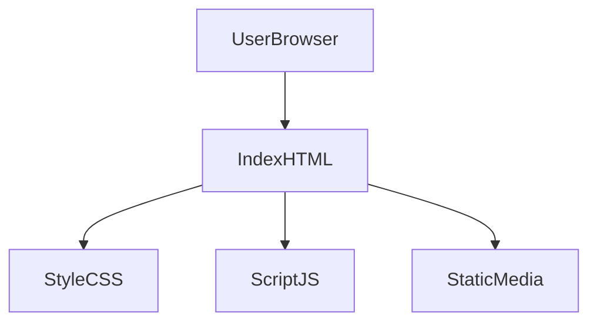

# REPOSITORY_OVERVIEW.md

> **Source File:** [REPOSITORY_OVERVIEW.md](https://github.com/test-company-prowiz/Note-Summerizer/blob/main/REPOSITORY_OVERVIEW.md)
> **Repository:** `Note-Summerizer`
> **Branch:** `main`

# Note-Summerizer — Repository Overview

### High-Level Purpose
The `Note-Summerizer` repository provides the client-side interface for an AI-powered lecture summarizer. Its primary objective is to offer a user-friendly web application for inputting lecture content from various sources (e.g., microphone, local files, YouTube links) and displaying summarized outputs, with options for different export formats. The current implementation emphasizes the front-end user experience, functioning as a browser-based demo with limited integrated AI logic.

### Architectural Structure
This repository primarily implements the presentation layer of a web application. It is structured as a client-side application consisting of:
*   **HTML (index.html)**: Defines the core structure and layout of the user interface.
*   **CSS (style.css)**: Provides the styling and visual presentation for the UI.
*   **JavaScript (script.js)**: Manages client-side interactivity, dynamic content updates, and form handling.
*   **Static Assets**: Includes background video files (`videos/desktop-video.mp4`) and external font dependencies (Google Material Symbols).
The architecture, as described by the provided file summary, does not detail a dedicated backend service for summarization or AI processing within this repository's scope, indicating these functions are either external or simulated for the demo.

### Core Components
*   **User Interface (UI) Definition**: The `index.html` file establishes the visual components such as input forms for source selection (mic, file, YouTube), export format selection, action buttons (process, theme toggle, delete chats), and containers for dynamic content (`chats-container`).
*   **Client-Side Interactivity**: The `script.js` file (inferred from `index.html`'s dependency) is responsible for handling user interactions, dynamically showing/hiding input fields, managing form submissions, and updating the UI based on user actions.
*   **Styling Engine**: The `style.css` file dictates the visual aesthetics, layout, and responsiveness of the application's interface.

### Interaction & Data Flow
1.  A user's web browser requests the `index.html` file, which serves as the application's entry point.
2.  The browser renders the HTML structure, applies the visual styles defined in `style.css`, and executes the client-side logic from `script.js`.
3.  Users interact with the UI to select an input source (e.g., YouTube link, audio file upload) and an desired export format (e.g., PDF, Word, JSON).
4.  Input data (e.g., YouTube URL, selected file) is provided via the relevant form fields.
5.  Upon activating the "Process" button, client-side JavaScript handles the input, manages UI state, and prepares for what is implied to be a summarization request.
6.  The application's "limited AI logic" and "browser-based demo" nature suggest that actual summarization processing might be simulated or expected from an external, unrepresented service, with results intended for display within the `chats-container`.

### Technology Stack
*   **Frontend**: HTML5, CSS3, JavaScript.
*   **Styling/Icons**: Google Material Symbols Rounded font.
*   **Media**: MP4 video format for background elements.

### Design Observations
The repository's design prioritizes a rich client-side user experience, offering a responsive and interactive interface for a summarization tool. The clear separation of HTML, CSS, and JavaScript promotes maintainability. The dynamic nature of the input forms, adapting to user choices, enhances usability. Notably, the project explicitly positions itself as a "browser-based demo with limited AI logic," indicating a focus on the front-end demonstration rather than a fully integrated, production-ready AI backend within this repository. This implies that the actual summarization engine is either external, simulated, or a future integration target.

### System Diagram

```mermaid
graph TD
UserBrowser[UserBrowser] --> IndexHTML[IndexHTML]
IndexHTML --> StyleCSS[StyleCSS]
IndexHTML --> ScriptJS[ScriptJS]
IndexHTML --> StaticMedia[StaticMedia]
```