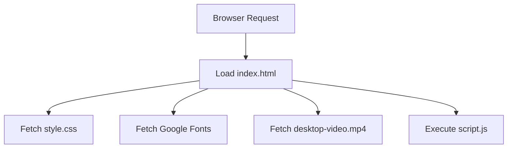

# index.html

### Overview
This file serves as the main entry point and user interface foundation for the AI-Powered Lecture Summarizer application. It defines the structural layout, basic styling links, and incorporates interactive elements for input selection, processing, and display, along with a background video.

### Architecture & Role
Architecturally, `index.html` functions as the client-side root document for a web application. It is responsible for rendering the initial UI components that users interact with. It belongs to the presentation layer, providing the static markup that is then enhanced by CSS for styling and `script.js` for dynamic behavior.

### Key Components
*   **`<head>` section**: Configures the document metadata, title, and links to external resources like Google Fonts and `style.css`.
*   **`.video-container`**: Holds a looping, muted background video (`desktop-video.mp4`) that plays automatically.
*   **`.app-header`**: Displays the main title and sub-heading for the application.
*   **`.suggestions`**: A list of suggested actions or features, each with an icon.
*   **`.chats-container`**: An empty `div` serving as a placeholder for dynamically loaded or generated chat content (e.g., summaries, prompts).
*   **`.prompt-container`**: Encapsulates user interaction elements:
    *   **`.prompt-form`**: Contains input controls for selecting the source (mic, file, YouTube), providing a YouTube URL, uploading a file, and choosing an export format.
    *   **`#process-btn`**: A submit button to initiate the summarization process.
    *   **`#theme-toggle-btn`**: A button to switch between UI themes.
    *   **`#delete-chats-btn`**: A button to clear existing chat content.
*   **Disclaimer Text**: Informational text regarding the demo's in-browser functionality and limited AI logic.
*   **``**: Links the primary JavaScript file responsible for client-side logic and interactivity.

### Execution Flow / Behavior
Upon loading, the browser parses `index.html`, renders the static content, and applies styles from `style.css`. The background video (`desktop-video.mp4`) begins to autoplay silently. The form elements within `.prompt-form` are initially visible, except for the `youtube-link` and `audio-file` inputs, which are hidden by default via `style="display:none;"`. The `script.js` file is loaded and executed last, allowing it to attach event listeners and implement dynamic behavior, such as toggling input visibility based on the selected source, handling form submissions, and managing theme changes or chat deletion.

### Dependencies
*   **External CSS**:
    *   `https://fonts.googleapis.com/css2?family=Material+Symbols+Rounded:opsz,wght,FILL,GRAD@32,400,0,0`: Google Fonts for Material Symbols Rounded icons.
*   **Internal CSS**:
    *   `style.css`: Provides the visual styling for all HTML elements.
*   **Internal Video**:
    *   `videos/desktop-video.mp4`: The background video asset.
*   **Internal JavaScript**:
    *   `script.js`: Contains the client-side logic for interactivity, form handling, and potentially communication with backend services or in-browser AI logic.

### Design Notes
*   **Progressive Enhancement**: The basic structure is provided by HTML, with CSS for presentation and JavaScript for interaction.
*   **User Input Modalities**: Supports multiple input types (microphone, local files, YouTube links) via distinct form controls, suggesting dynamic UI updates for input selection.
*   **Export Functionality**: Includes options to export summaries in various formats (PDF, Word, JSON), implying client-side or server-side processing for output generation.
*   **Interactive Elements**: Dedicated buttons for theme toggling and chat deletion indicate features beyond basic content display, managed by `script.js`.
*   **Client-Side Focus**: The disclaimer text explicitly notes "fully in-browser with limited AI logic," indicating a strong emphasis on client-side processing for the demo.
*   **Content Placeholder**: The `.chats-container` suggests a dynamic area where conversation or summary output will be rendered by JavaScript.

### Diagram (Optional)
