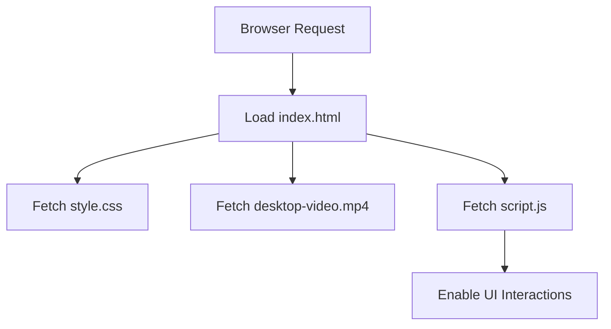

# index.html

> **Source File:** [index.html](https://github.com/Note-Summerizer/blob/main/index.html)  
> **Repository:** `Note-Summerizer`  
> **Branch:** `main`

### Overview
The `index.html` file serves as the main entry point and the structural foundation for the "AI-Powered Lecture Summarizer" web application's user interface. It defines the layout, content, and initial presentation for users to interact with the summarizer functionality.

### Architecture & Role
Architecturally, this file represents the presentation layer (view) of the client-side application. It is the root document loaded by the browser, providing the semantic structure and visual elements. It acts as the container for dynamic content managed by associated CSS and JavaScript files.

### Key Components
*   **Metadata Configuration**: The `<head>` section configures document encoding (`UTF-8`), viewport settings for responsiveness, and the page title.
*   **Styling & Icons**: Links to Google Fonts for Material Symbols and the local `style.css` file for visual presentation.
*   **Background Video**: A `
` holds an autoplaying, muted, and looping background video (`desktop-video.mp4`).
*   **Main Content Wrapper**: A `
` encapsulates the primary UI elements, including the application header, feature suggestions, chat display area, and user input controls.
*   **Application Header**: An `<header class="app-header">` displays the main application title and a descriptive sub-heading.
*   **Feature Suggestions**: A `<ul>` list (`suggestions`) outlines key functionalities like "Use mic," "Upload an audio or video file," and "Paste a YouTube link."
*   **Chats Container**: An empty `
` is designated for displaying generated summaries or interaction history.
*   **Prompt Container**: The `
` houses the user interaction form.
    *   **Input Form**: A `<form class="prompt-form">` includes a `select` element for choosing the input source (Mic, File, YouTube), conditionally displayed `input` fields for YouTube URLs and file uploads, and a `select` element for export format.
    *   **Action Buttons**: Buttons for processing input (`process-btn`), toggling the theme (`theme-toggle-btn`), and deleting chat history (`delete-chats-btn`) are present.
*   **Client-Side Script Inclusion**: A `` tag at the end of the `<body>` links to the main JavaScript file for dynamic behavior.

### Execution Flow / Behavior
1.  Upon a browser request, `index.html` is loaded and parsed, establishing the Document Object Model (DOM).
2.  External resources, including `style.css`, Google Material Symbols fonts, and `desktop-video.mp4`, are fetched and applied. The background video begins playback immediately.
3.  The static HTML structure and default styling render the initial user interface, displaying the header, feature suggestions, and the prompt form with its default input selection.
4.  Subsequently, `script.js` is loaded and executed. This script is responsible for:
    *   Handling user interactions with the form elements, such as dynamically showing/hiding the YouTube URL input or file upload input based on the selected `input-type`.
    *   Implementing the logic for the "process," "theme toggle," and "delete chats" buttons.
    *   Managing the display of summaries within the `chats-container`.
    *   Executing any in-browser AI logic or facilitating communication with backend services as indicated by the disclaimer.

### Dependencies
*   **External CSS**:
    *   `https://fonts.googleapis.com/css2?family=Material+Symbols+Rounded:opsz,wght,FILL,GRAD@32,400,0,0`: Provides the Material Symbols icon set used for various UI elements.
*   **Internal CSS**:
    *   `style.css`: Contains the application's specific styling rules, layout definitions, and visual presentation.
*   **Internal JavaScript**:
    *   `script.js`: The core client-side script that controls UI interactivity, form logic, and overall application behavior.
*   **Local Media**:
    *   `videos/desktop-video.mp4`: A video file used as a looping background element.

### Design Notes
*   The document is designed for responsiveness, indicated by the `viewport` meta tag.
*   The user interface design prioritizes clear action calls, utilizing Material Symbols for intuitive iconography.
*   Input mechanisms (microphone, file upload, YouTube link) are consolidated within a single form, with dynamic visibility managed by client-side JavaScript to streamline user experience.
*   The `chats-container` is an empty placeholder, indicating that summary outputs or conversational elements are dynamically added by JavaScript.
*   A explicit disclaimer informs users about the in-browser nature and limited AI logic of the demo, setting appropriate expectations.

### Diagram (Optional)
