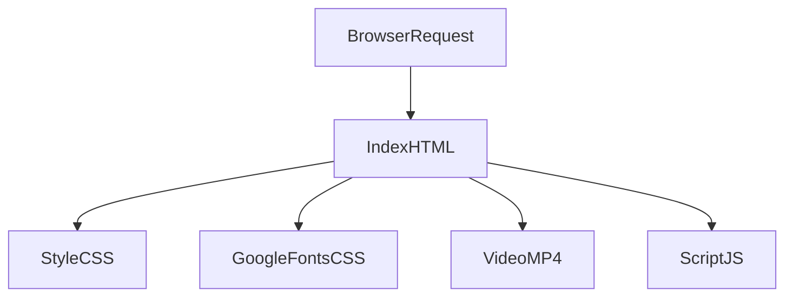

# index.html

> **Source File:** [index.html](https://github.com/test-company-prowiz/Note-Summerizer/blob/main/index.html)
> **Repository:** `Note-Summerizer`
> **Branch:** `main`

# index.html

### Overview
This file serves as the main entry point for the Lecture Summarizer user interface. It defines the structure and static content of the web page, including navigation, interactive forms for input selection and export, and placeholders for dynamic content like chat messages.

### Architecture & Role
Architecturally, `index.html` functions as the presentation layer on the client-side. It is the root document that the web browser loads, orchestrating the inclusion of stylesheets, video assets, and client-side JavaScript logic to render the complete user interface. It belongs to the frontend component of the system.

### Key Components
*   **`head` section**: Configures document metadata, character set, viewport, title, and links external resources like Google Fonts and `style.css`.
*   **`video-container`**: A `div` element that holds a `video` tag configured for an autoplaying, muted, and looping background video (`videos/desktop-video.mp4`).
*   **`container`**: The main content wrapper, housing the application header, suggestions list, chat area, and prompt/control panel.
*   **`app-header`**: Contains the main title and sub-heading for the application.
*   **`suggestions` list**: An unordered list (`ul`) presenting key features with descriptive text and corresponding Material Symbols icons.
*   **`chats-container`**: An empty `div` intended to dynamically display chat or summary content.
*   **`prompt-container`**: Encapsulates user interaction elements:
    *   **`prompt-form`**: A `form` containing `select` elements for input type (`mic`, `file`, `youtube`) and export format (`pdf`, `word`, `json`), `input` fields for YouTube URLs and file uploads, and a `process-btn` to initiate actions.
    *   **`theme-toggle-btn`**: A button to switch themes.
    *   **`delete-chats-btn`**: A button to clear chat content.
*   **`script.js`**: An external JavaScript file linked at the end of the `body`, responsible for client-side interactivity and application logic.

### Execution Flow / Behavior
Upon loading in a web browser, `index.html` renders the initial user interface. It displays a background video, the application header, and a list of suggested actions. The form elements within `prompt-container` are initially rendered, with certain input fields (`youtube-link`, `audio-file`) hidden by default. The file primarily defines the static layout and controls; dynamic behavior, such as toggling input fields based on `input-type` selection, processing user requests, or populating the `chats-container`, is managed by the associated `script.js` file.

### Dependencies
*   **`style.css`**: Provides the cascading style rules for the visual presentation of the HTML elements.
*   **`https://fonts.googleapis.com/css2?family=Material+Symbols+Rounded:...`**: External stylesheet from Google Fonts, providing the Material Symbols icons used throughout the UI.
*   **`videos/desktop-video.mp4`**: A local video file used as a looping background element.
*   **`script.js`**: A local JavaScript file that provides the interactive logic for the forms, buttons, and potentially dynamic content updates within the page.

### Design Notes
The structure suggests a single-page application (SPA) design, where `index.html` provides the shell and `script.js` handles most of the interactive and dynamic content rendering. The presence of hidden input fields and a `select` element for input type implies dynamic form field visibility controlled by JavaScript. The disclaimer about "fully in-browser with limited AI logic" indicates this HTML is part of a client-side demo or prototype, with core AI processing likely deferred to a backend or a limited client-side implementation within `script.js`.

### Diagram

```mermaid
graph TD
BrowserRequest --> IndexHTML
IndexHTML --> StyleCSS
IndexHTML --> GoogleFontsCSS
IndexHTML --> VideoMP4
IndexHTML --> ScriptJS
```