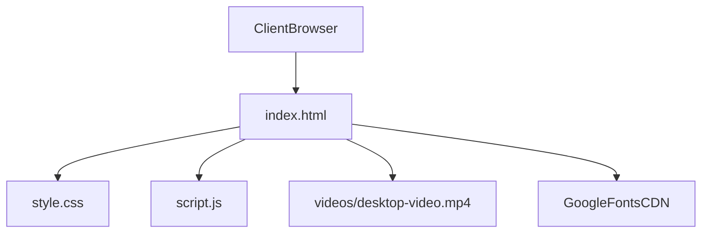

# index.html

> **Source File:** [index.html](https://github.com/test-company-prowiz/Note-Summerizer/blob/main/index.html)
> **Repository:** `Note-Summerizer`
> **Branch:** `main`

# index.html

### Overview
This file serves as the main entry point for the client-side user interface of the AI-Powered Lecture Summarizer application. It defines the structural layout, static content, and integrates client-side styling and scripting to provide interactive functionality.

### Architecture & Role
Architecturally, `index.html` resides at the presentation layer of the application. It is the root document loaded by a web browser, rendering the initial user interface. Its role is to structure the UI elements, link necessary stylesheets and client-side scripts, and display static text and multimedia assets.

### Key Components
*   **HTML Structure**: Defines the overall page layout, including a header, feature suggestions, a chat area placeholder, and input controls.
*   **Video Background**: A `<video>` element (`desktop-video.mp4`) provides an autoplaying, muted, and looping background.
*   **Application Header**: Displays the main title ("AI-Powered Lecture Summarizer") and a subtitle describing its functionality.
*   **Feature Suggestions**: A `<ul>` list outlines key features: real-time mic summary, file upload, YouTube link pasting, and summary export options.
*   **Input Controls**: A `<form>` element containing:
    *   `select#input-type`: Dropdown for selecting input source (Mic, File, YouTube).
    *   `input#youtube-link`: Text input for YouTube URLs (initially hidden).
    *   `input#audio-file`: File input for audio/video uploads (initially hidden).
    *   `select#export-format`: Dropdown for selecting summary export format (PDF, Word, JSON).
    *   `button#process-btn`: Initiates the summary process.
*   **Utility Buttons**: `button#theme-toggle-btn` for UI theme control and `button#delete-chats-btn` for clearing conversations.
*   **Disclaimers**: Informative text regarding the demo's in-browser functionality and limited AI logic.

### Execution Flow / Behavior
When `index.html` is loaded by a browser, the following occurs:
1.  The HTML document structure is parsed and rendered.
2.  The external stylesheet (`style.css`) is fetched and applied for visual styling.
3.  The Material Symbols Rounded font is loaded from Google Fonts for iconography.
4.  The background video (`videos/desktop-video.mp4`) begins playback.
5.  The interactive elements, such as input selectors and buttons, are displayed according to their initial state.
6.  The `script.js` file is loaded and executed, enabling dynamic behaviors like toggling input fields based on `input-type` selection, handling form submissions, and managing theme/chat deletion actions.

### Dependencies
*   **Internal Stylesheet**: `style.css` provides the visual styling for all HTML elements.
*   **Internal Script**: `script.js` provides the client-side interactivity and logic for the UI components.
*   **External Font**: `https://fonts.googleapis.com/css2?family=Material+Symbols+Rounded` for displaying icons.
*   **Local Video Asset**: `videos/desktop-video.mp4` for the animated background.

### Design Notes
The design leverages a single HTML file for the entire application interface, indicating a single-page application (SPA) approach, although without a framework. Conditional display of input fields (`youtube-link`, `audio-file`) using `style="display:none;"` suggests these elements are dynamically managed by `script.js` to show/hide based on user selection. The use of semantic HTML elements and clear class naming improves readability and maintainability. The disclaimer highlights the client-side nature and potentially limited backend interaction of this specific demo.

### Diagram

```mermaid
graph TD
ClientBrowser[ClientBrowser] --> IndexHTML[index.html]
IndexHTML --> StyleCSS[style.css]
IndexHTML --> ScriptJS[script.js]
IndexHTML --> VideoMP4[videos/desktop-video.mp4]
IndexHTML --> GoogleFonts[GoogleFontsCDN]
```