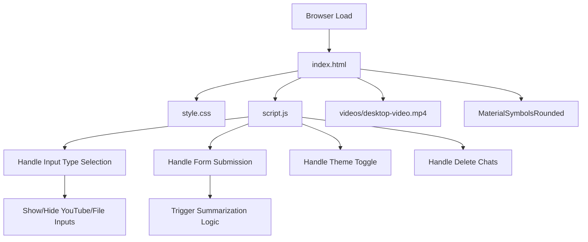

# index.html

> **Source File:** [index.html](https://github.com/test-company-prowiz/Note-Summerizer/blob/main/index.html)
> **Repository:** `Note-Summerizer`
> **Branch:** `main`

# index.html

### Overview
This file serves as the main entry point for the Lecture Summarizer web application, defining its user interface structure. It presents the core layout, static content, and interactive form elements for user input and actions within the system.

### Architecture & Role
Architecturally, `index.html` resides at the client-side presentation layer. It is the root HTML document loaded by the web browser, providing the initial document object model (DOM) upon which CSS styling and JavaScript interactivity are built.

### Key Components
*   **`app-header`**: Displays the application title and a brief description of its capabilities.
*   **`suggestions`**: A list detailing the primary modes of operation (Mic, File upload, YouTube link) and output options (PDF, Word, JSON).
*   **`chats-container`**: An empty `div` element intended as a dynamic area for displaying chat-like interactions or summary outputs, populated by JavaScript.
*   **`prompt-container`**: Encapsulates the user input form, including:
    *   `input-type` dropdown: Allows selection of input source (Mic, File, YouTube).
    *   `youtube-link` input: Text field for YouTube URLs, conditionally displayed.
    *   `audio-file` input: File picker for audio/video uploads, conditionally displayed.
    *   `export-format` dropdown: Specifies the desired summary output format.
    *   `process-btn`: Initiates the summarization process.
*   **`theme-toggle-btn`**: A button to switch between UI themes.
*   **`delete-chats-btn`**: A button to clear existing chat/summary content.
*   **`video-container`**: Contains a background video element for visual ambiance.

### Execution Flow / Behavior
Upon browser load, the HTML document is parsed and rendered, displaying the initial UI elements.
1.  The background video `videos/desktop-video.mp4` begins autoplaying.
2.  The Google Material Symbols font and `style.css` are loaded to apply visual styles and icons.
3.  Static header and feature suggestions are presented.
4.  The input form elements are available for user interaction.
5.  `script.js` is loaded last, providing dynamic functionality such as toggling input fields based on `input-type` selection, handling form submissions, managing themes, and clearing chats.

### Dependencies
*   **Internal**:
    *   `style.css`: Provides all custom styling for the page layout and components.
    *   `script.js`: Implements the interactive logic for the UI elements, form handling, and potentially communication with backend services or client-side AI.
    *   `videos/desktop-video.mp4`: The background video asset.
*   **External**:
    *   `https://fonts.googleapis.com/css2?family=Material+Symbols+Rounded`: Google Fonts stylesheet for "Material Symbols Rounded" icons, used throughout the UI.

### Design Notes
The UI design is responsive and component-based, utilizing semantic HTML5 elements. Conditional display of input fields (YouTube URL, file input) indicates a JavaScript-driven interaction model. The presence of a `chats-container` suggests an asynchronous, possibly conversational, interaction flow where summaries or intermediate messages are displayed dynamically. The disclaimer highlights the demo nature and client-side processing, implying an initial focus on frontend interactivity with limited integrated AI logic within this specific version.

### Diagram

```mermaid
graph TD
BrowserLoad[Browser Load] --> IndexHTML[index.html]
IndexHTML --> StyleCSS[style.css]
IndexHTML --> ScriptJS[script.js]
IndexHTML --> DesktopVideo[videos/desktop-video.mp4]
IndexHTML --> GoogleFonts[MaterialSymbolsRounded]

ScriptJS --> HandleInputSelection[Handle Input Type Selection]
ScriptJS --> HandleFormSubmit[Handle Form Submission]
ScriptJS --> HandleThemeToggle[Handle Theme Toggle]
ScriptJS --> HandleDeleteChats[Handle Delete Chats]

HandleInputSelection --> ShowHideInputs[Show/Hide YouTube/File Inputs]
HandleFormSubmit --> ProcessSummarization[Trigger Summarization Logic]
```