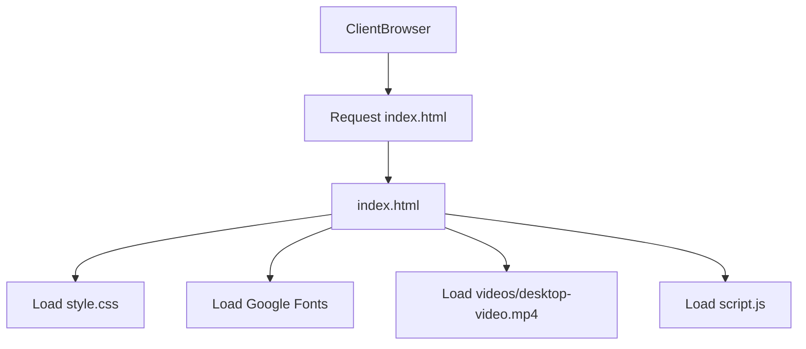

# index.html

> **Source File:** [index.html](https://github.com/test-company-prowiz/Note-Summerizer/blob/main/index.html)
> **Repository:** `Note-Summerizer`
> **Branch:** `main`

# index.html

### Overview
This file serves as the main entry point and user interface for the AI-Powered Lecture Summarizer application. It defines the structural layout and presents interactive elements for users to input lecture sources (microphone, file upload, YouTube link) and select export formats for summaries.

### Architecture & Role
Architecturally, `index.html` functions as the presentation layer (view) of a client-side web application. It is a static HTML document served directly to the browser, which then relies on linked stylesheets for visual presentation and a JavaScript file for dynamic behavior and application logic.

### Key Components
*   **HTML5 Doctype and Metadata**: Standard `<!DOCTYPE html>` declaration and essential meta tags for character set, viewport, and application title.
*   **External Stylesheets**: Links to `style.css` for application-specific styling and Google Fonts for `Material Symbols Rounded` icons.
*   **Video Background**: A `<video>` element (`videos/desktop-video.mp4`) configured for autoplay, mute, loop, and inline playback, serving as a background visual element.
*   **Application Header**: Contains the main title (`AI-Powered Lecture Summarizer`) and a subtitle describing its capabilities.
*   **Feature Suggestions**: A `<ul>` list outlining the primary features: real-time mic summary, file upload, YouTube link processing, and summary export.
*   **Chats Container**: An empty `
` (`.chats-container`) intended to dynamically display summary outputs or chat interactions.
*   **Prompt Container**: Encapsulates user interaction elements:
    *   **Input Form**: A `<form>` containing controls for selecting input sources (`mic`, `file`, `youtube`), providing input (YouTube URL, audio/video file), and choosing export formats (`pdf`, `word`, `json`).
    *   **Action Buttons**: `process-btn` to initiate summarization, `theme-toggle-btn` for UI theme switching, and `delete-chats-btn` for clearing summaries.
*   **Disclaimer Text**: Informational text regarding the demo's in-browser functionality and limited AI logic.
*   **JavaScript Inclusion**: A `<script>` tag referencing `script.js` at the end of the `<body>` for client-side scripting.

### Execution Flow / Behavior
Upon a browser request, the web server delivers `index.html`. The browser then:
1.  Parses the HTML structure and renders the initial static content.
2.  Fetches and applies `style.css` and the Google Fonts stylesheet for visual styling and icons.
3.  Loads and plays the `videos/desktop-video.mp4` in the background.
4.  Displays the header, feature suggestions, and the interactive prompt form. The YouTube link and file upload inputs are initially hidden via `style="display:none;"`, implying their visibility is managed by JavaScript.
5.  Executes `script.js` after the DOM is loaded, enabling dynamic functionality such as handling user input selections, processing requests, managing UI state (e.g., theme toggle, chat deletion), and potentially interacting with a summarization engine.

### Dependencies
*   **Internal Stylesheet**: `style.css` (for application layout and styling).
*   **External Stylesheet**: `https://fonts.googleapis.com/css2?family=Material+Symbols+Rounded:opsz,wght,FILL,GRAD@32,400,0,0` (for Google Material Symbols icons).
*   **Video Asset**: `videos/desktop-video.mp4` (for the background video).
*   **Client-Side Script**: `script.js` (for all interactive logic and dynamic content updates).

### Design Notes
The design follows a single-page application (SPA) pattern, where `index.html` provides the static shell, and `script.js` is responsible for all dynamic content and interaction. The use of `display:none` on certain input fields suggests a dynamic UI where input options are revealed based on user selection, improving user experience by reducing clutter. The explicit disclaimer about "fully in-browser with limited AI logic" indicates a client-side processing model or a highly optimized local AI component, potentially with minimal or no backend interaction for summarization in this specific demo context.

### Diagram

```mermaid
graph TD
ClientBrowser[ClientBrowser] --> RequestIndexHTML[Request index.html]
RequestIndexHTML --> IndexHTML[index.html]
IndexHTML --> LoadStyleCSS[Load style.css]
IndexHTML --> LoadGoogleFonts[Load Google Fonts]
IndexHTML --> LoadDesktopVideo[Load videos/desktop-video.mp4]
IndexHTML --> LoadScriptJS[Load script.js]
```