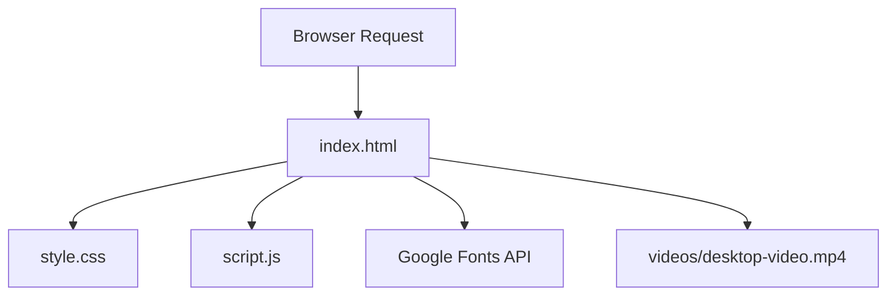

# index.html

> **Source File:** [index.html](https://github.com/test-company-prowiz/Note-Summerizer/blob/main/index.html)
> **Repository:** `Note-Summerizer`
> **Branch:** `main`

# index.html

### Overview
This file serves as the primary entry point and user interface for the AI-Powered Lecture Summarizer application. It establishes the foundational HTML structure, incorporates styling, and integrates client-side scripting to manage user interactions and display dynamic content.

### Architecture & Role
This file operates at the presentation layer, serving as the client-side interface for the application. It is directly rendered by a web browser, forming the visual and interactive foundation upon which the application's functionality is built. It does not contain server-side logic.

### Key Components
*   **`video-container`**: A `div` element containing an autoplaying, muted, looping background video (`videos/desktop-video.mp4`).
*   **`app-header`**: Displays the main title ("AI-Powered Lecture Summarizer") and a sub-heading.
*   **`suggestions`**: An unordered list (`ul`) presenting potential input methods and features (mic, file upload, YouTube link, export).
*   **`chats-container`**: An empty `div` intended to display chat-like interactions or summary outputs, managed by client-side JavaScript.
*   **`prompt-container`**: Encapsulates user input controls.
    *   **`prompt-form`**: Contains `select` elements for input source (`mic`, `file`, `youtube`) and export format (`pdf`, `word`, `json`).
    *   **`youtube-link`**: An `input` field for YouTube URLs, initially hidden.
    *   **`audio-file`**: An `input` field for file uploads (audio/video), initially hidden.
    *   **`process-btn`**: A button to trigger the summarization process.
*   **`theme-toggle-btn`**: A button to switch between themes.
*   **`delete-chats-btn`**: A button to clear chat history or summaries.
*   **`disclaimer-text`**: Paragraphs providing information about the demo's capabilities and copyright.

### Execution Flow / Behavior
Upon browser load, `index.html` is parsed and rendered.
1.  The `head` section loads metadata, the page title, Google Material Symbols Rounded font, and `style.css`.
2.  The `body` renders the background video, the main header, feature suggestions, and the interactive prompt area.
3.  Initially, the YouTube link input and file upload input fields are hidden.
4.  The `script.js` file is loaded and executed, which is responsible for adding dynamic behavior, such as toggling input field visibility based on the selected input source, handling form submissions, managing theme changes, and clearing chats.
5.  User interactions with the form elements and buttons are processed by the associated JavaScript.

### Dependencies
*   **`style.css`**: External stylesheet defining the visual presentation of the UI.
*   **`script.js`**: External JavaScript file providing interactive functionality and client-side logic.
*   **`https://fonts.googleapis.com/css2?family=Material+Symbols+Rounded:opsz,wght,FILL,GRAD@32,400,0,0`**: Google Fonts API for loading Material Symbols Rounded icons.
*   **`videos/desktop-video.mp4`**: A local video file used as a background element.

### Design Notes
*   The use of `<meta name="viewport">` ensures responsiveness across different devices.
*   The `playsinline` attribute on the video element is crucial for autoplaying videos on iOS devices.
*   The input fields for YouTube URL and file upload are initially hidden, implying dynamic visibility control via JavaScript based on the selected input type.
*   The `chats-container` is an empty `div`, indicating that its content will be dynamically generated and managed by `script.js`.
*   The explicit disclaimers clarify that this is a browser-based demo with limited AI logic, managing user expectations.

### Diagram

```mermaid
graph TD
BrowserRequest[Browser Request] --> IndexHTML[index.html]
IndexHTML --> StyleCSS[style.css]
IndexHTML --> ScriptJS[script.js]
IndexHTML --> GoogleFonts[Google Fonts API]
IndexHTML --> DesktopVideo[videos/desktop-video.mp4]
```