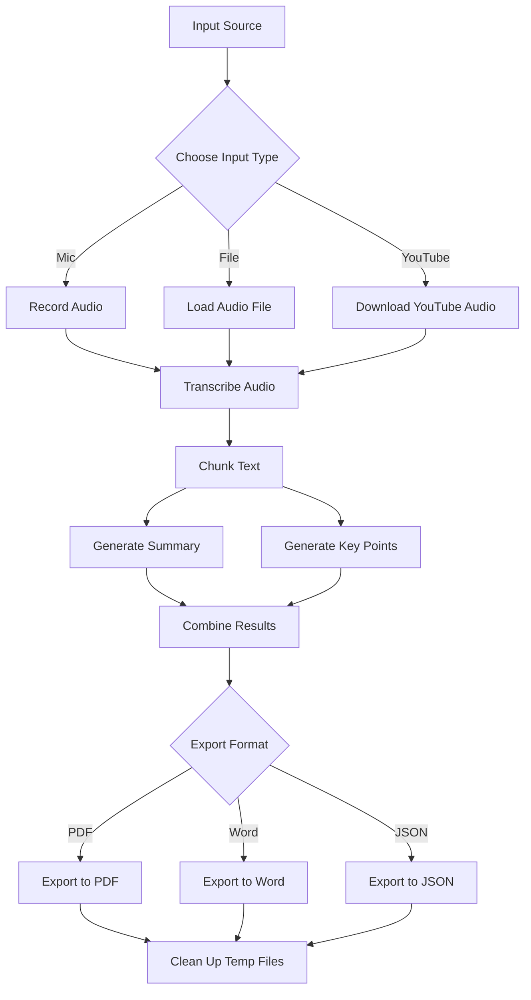

# lecture4.py

> **Source File:** [lecture4.py](https://github.com/Note-Summerizer/blob/main/lecture4.py)  
> **Repository:** `Note-Summerizer`  
> **Branch:** `main`

### Overview
This file provides a comprehensive set of functionalities for processing audio and video content to generate summaries and key points. It supports input from a microphone, local audio files, or YouTube URLs, transcribes the content, processes the text using a summarization model, and exports the results into PDF, Word, or JSON formats.

### Architecture & Role
This file serves as a monolithic processing script within a larger system context. It encapsulates the entire workflow from input acquisition to final document generation. Architecturally, it functions as a self-contained utility layer, directly interacting with system audio devices, external services (YouTube), local file systems, and NLP models. It does not expose an API but provides a single `process_input` function as its primary entry point.

### Key Components
*   `samplerate`: Global integer specifying the audio sample rate for recording.
*   `summarizer_pipeline`: A global instance of a Hugging Face `transformers` summarization pipeline, initialized with the `google/flan-t5-large` model.
*   `record_audio(duration, filename)`: Records audio from the default microphone for a specified duration and saves it as a WAV file.
*   `transcribe_audio(file_path)`: Uses the Whisper "medium" model to transcribe an audio file into text.
*   `transcribe_youtube(youtube_url)`: Downloads audio from a YouTube URL using `yt_dlp`, converts it to MP3, and then transcribes it.
*   `chunk_text(text, max_words)`: Splits a given text into smaller chunks based on a maximum word count, typically for processing by language models.
*   `generate_summary(text)`: Creates an overall summary of the input text by chunking it and processing each chunk with the `summarizer_pipeline`.
*   `generate_key_points(text)`: Extracts key points from the input text, also using chunking and the `summarizer_pipeline` with a specific prompt.
*   `export_to_pdf(summary, overview, keypoints)`: Generates a PDF document containing the summary, overview, and key points.
*   `export_to_word(summary, overview, keypoints)`: Generates a Microsoft Word document (.docx) with the processed content.
*   `export_to_json(summary, overview, keypoints)`: Exports the summary, overview, and key points to a JSON file.
*   `process_input(source_type, file_path, youtube_url, duration, export_format)`: The main orchestration function that handles the entire workflow based on the specified input source type and desired output format.

### Execution Flow / Behavior
The `process_input` function is the central control point.
1.  **Input Source Determination**: It first determines the input source:
    *   If `source_type` is "mic", it calls `record_audio` to capture live audio.
    *   If `source_type` is "file", it uses the provided `file_path`.
    *   If `source_type` is "youtube", it calls `transcribe_youtube` to download and transcribe content.
2.  **Transcription**: The chosen audio input is then transcribed into text using `transcribe_audio` or implicitly within `transcribe_youtube`.
3.  **Text Processing**: The full transcript is passed to `generate_summary` for an overall summary, `generate_summary` with a truncated input for a brief overview, and `generate_key_points` for bulleted key points. These functions utilize `chunk_text` to manage the input size for the `summarizer_pipeline`.
4.  **Export**: Based on the `export_format` parameter, the processed summaries and key points are exported using `export_to_pdf`, `export_to_word`, or `export_to_json`.
5.  **Cleanup**: Any temporary audio files generated during the process (e.g., from microphone recording or YouTube download) are removed from the filesystem.
6.  **Result**: The function returns a dictionary containing the generated summaries, key points, and the path to the output file, or an error message if an exception occurs.

### Dependencies
*   **os**: For file system operations, specifically removing temporary files.
*   **json**: For exporting processed data into JSON format.
*   **whisper**: External library for robust speech-to-text transcription.
*   **sounddevice**: For recording audio from the microphone.
*   **scipy.io.wavfile**: Used by `sounddevice` to write WAV audio files.
*   **transformers**: Hugging Face library used for loading and executing the "google/flan-t5-large" summarization model.
*   **fpdf**: Library for generating PDF documents.
*   **docx**: Library for creating and modifying Microsoft Word (.docx) files.
*   **yt_dlp**: For downloading audio/video content from YouTube and similar platforms.

### Design Notes
*   **Monolithic Structure**: The file combines several distinct functionalities (audio recording, transcription, summarization, document generation) into a single script. This simplifies deployment but can reduce modularity and reusability of individual components.
*   **Global Configuration**: `samplerate` and `summarizer_pipeline` are global variables. While convenient for this script, in larger applications, explicit dependency injection or a dedicated configuration module would improve testability and maintainability.
*   **Error Handling**: Basic `try-except` blocks are used for error handling, returning error messages. More granular or custom exception types could be implemented for better diagnostics.
*   **Text Chunking**: The `chunk_text` function addresses the token limit constraints of language models by splitting long texts into manageable parts before summarization, ensuring that even lengthy inputs can be processed.
*   **Temporary File Management**: The `process_input` function explicitly manages temporary audio files, ensuring they are cleaned up after transcription, which is crucial for preventing disk space accumulation.

### Diagram (Optional)
