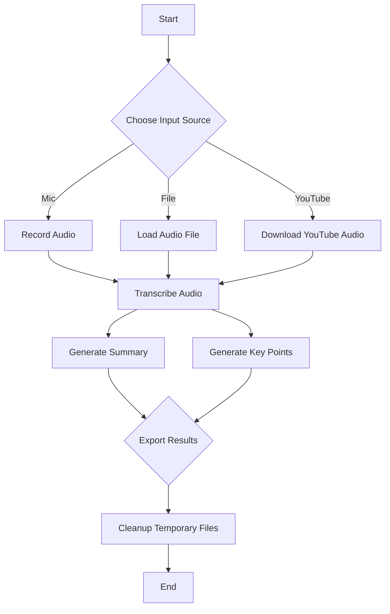

# lecture4.py

### Overview
This file provides a comprehensive set of functionalities for processing audio inputs (microphone, local file, or YouTube URL), transcribing them into text, generating summaries and key points using a pre-trained language model, and exporting the results into various formats (PDF, Word, JSON). It acts as an end-to-end lecture processing utility.

### Architecture & Role
Architecturally, this file serves as a monolithic application utility or a core processing module within a larger system. It operates at the application layer, encapsulating logic for audio handling, natural language processing (NLP), and document generation. It can be invoked directly as a script or integrated as a function-level dependency.

### Key Components
*   **`samplerate`**: Global configuration for audio recording, set to 44100 Hz.
*   **`summarizer_pipeline`**: A pre-initialized Hugging Face `transformers` pipeline for summarization using the `google/flan-t5-large` model.
*   **`record_audio(duration, filename)`**: Records audio from the default microphone for a specified duration and saves it as a WAV file.
*   **`transcribe_audio(file_path)`**: Transcribes an audio file into text using the Whisper "medium" model.
*   **`transcribe_youtube(youtube_url)`**: Downloads the audio from a YouTube URL, converts it to MP3, and then transcribes it.
*   **`chunk_text(text, max_words)`**: Splits a given text into smaller chunks based on sentence boundaries, ensuring each chunk does not exceed a specified word limit. This is crucial for processing long texts with LLMs.
*   **`generate_summary(text)`**: Generates a concise summary of the input text by processing chunks through the `summarizer_pipeline`.
*   **`generate_key_points(text)`**: Extracts key points from the input text, also utilizing chunking and the `summarizer_pipeline` with a specific prompt.
*   **`export_to_pdf(summary, overview, keypoints)`**: Formats and exports the processed information into a PDF document named `lecture_summary.pdf`.
*   **`export_to_word(summary, overview, keypoints)`**: Formats and exports the processed information into a Word document named `lecture_summary.docx`.
*   **`export_to_json(summary, overview, keypoints)`**: Exports the processed information into a JSON file named `lecture_summary.json`.
*   **`process_input(source_type, file_path, youtube_url, duration, export_format)`**: The main orchestration function. It handles input source selection, initiates transcription, generates summaries and key points, exports the results, and cleans up temporary audio files.

### Execution Flow / Behavior
The primary execution path is through the `process_input` function:
1.  **Input Acquisition**: Based on `source_type` (mic, file, youtube), it either records audio, uses an existing audio file, or downloads and extracts audio from a YouTube URL. Temporary audio files are tracked for cleanup.
2.  **Transcription**: The acquired audio is transcribed into text using the Whisper model.
3.  **Text Processing**: The full transcript is then used to generate a detailed summary, an overview (from the first 1000 characters), and key points. This involves chunking the text to fit the language model's context window.
4.  **Export**: The generated summary, overview, and key points are exported to the specified format (PDF, Word, or JSON).
5.  **Cleanup**: Any temporary audio files created during the process (e.g., mic recording, YouTube download) are removed from the filesystem.
6.  **Return**: A dictionary containing the generated text outputs and the path to the exported file is returned, or an error message if an exception occurs.

### Dependencies
*   **`os`**: For file system operations, specifically temporary file cleanup.
*   **`json`**: For serializing and deserializing data into JSON format for export.
*   **`whisper`**: An OpenAI library for robust speech-to-text transcription.
*   **`sounddevice`**: Python library for playing and recording sound, used for microphone input.
*   **`scipy.io.wavfile`**: Used to write recorded audio data to a WAV file.
*   **`transformers`**: Hugging Face library for natural language processing, specifically to load and use the `google/flan-t5-large` model for summarization.
*   **`fpdf`**: A library for generating PDF documents.
*   **`docx`**: A library for creating and updating Microsoft Word files.
*   **`yt_dlp`**: A command-line program to download videos from YouTube and other video sites, used here to extract audio from YouTube URLs.

### Design Notes
*   **Modular Design**: The file is structured with distinct functions for each core task (recording, transcribing, chunking, summarizing, exporting), promoting readability and potential reuse.
*   **LLM Context Management**: The `chunk_text` function is a crucial design decision to handle potentially long transcripts, ensuring that text fits within the context window of the `google/flan-t5-large` summarization model, which typically has input length limitations.
*   **Error Handling**: Basic `try-except` blocks are implemented at the function level and within `process_input` to catch and report operational errors, returning an error dictionary for consistent output.
*   **Temporary File Management**: The `process_input` function includes explicit logic to clean up intermediate audio files (e.g., mic recordings, downloaded YouTube audio) to prevent disk space accumulation.
*   **Extensibility**: The design allows for easy addition of new export formats or different summarization models by adding new functions and extending the `process_input` logic.

### Diagram (Optional)
