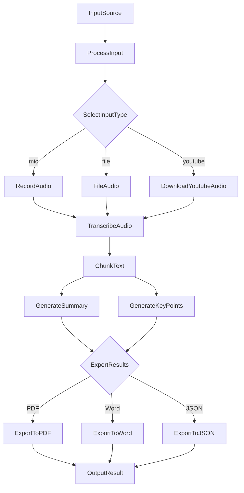

# lecture4.py

> **Source File:** [lecture4.py](https://github.com/test-company-prowiz/Note-Summerizer/blob/main/lecture4.py)
> **Repository:** `Note-Summerizer`
> **Branch:** `main`

# lecture4.py

### Overview
This file implements a utility for processing audio inputs, including live microphone recordings, local audio files, or YouTube videos. It transcribes the audio content, generates an overall summary and key points using a pre-trained transformer model, and then exports the results into various formats such as PDF, Word, or JSON.

### Architecture & Role
This file acts as a standalone application or a core processing module within a larger system. Architecturally, it integrates multiple functionalities: audio I/O, machine learning inference (transcription and summarization), and document generation. It operates at a business logic or application layer, orchestrating these components to achieve its primary goal of content summarization.

### Key Components
*   `samplerate`: Global configuration for audio recording quality.
*   `summarizer_pipeline`: A global Hugging Face `transformers` pipeline initialized with `google/flan-t5-large` for text summarization.
*   `record_audio(duration, filename)`: Captures audio from the default microphone for a specified duration and saves it as a WAV file.
*   `transcribe_audio(file_path)`: Uses the `whisper` library with the "medium" model to convert an audio file's content into text.
*   `transcribe_youtube(youtube_url)`: Downloads the audio track from a given YouTube URL, saves it locally as an MP3, and then transcribes it using `transcribe_audio`.
*   `chunk_text(text, max_words)`: A utility function to break down long text into smaller segments based on a maximum word count, preventing exceeding model input limits.
*   `generate_summary(text)`: Processes text using the `summarizer_pipeline` to create a concise summary. It utilizes `chunk_text` for longer inputs.
*   `generate_key_points(text)`: Similar to `generate_summary`, but formulates a prompt to extract key information as bullet points from the text.
*   `export_to_pdf(summary, overview, keypoints)`: Generates a PDF document containing the summary, overview, and key points.
*   `export_to_word(summary, overview, keypoints)`: Creates a Word document (`.docx`) with the processed text.
*   `export_to_json(summary, overview, keypoints)`: Exports the extracted information into a structured JSON file.
*   `process_input(source_type, file_path, youtube_url, duration, export_format)`: The main orchestrator function. It handles the input source selection, initiates transcription, performs summarization, and manages the export process, including temporary file cleanup.

### Execution Flow / Behavior
The `process_input` function drives the primary execution flow:
1.  **Input Acquisition**: Based on `source_type` (microphone, local file, or YouTube URL), it either records audio, uses a provided file path, or downloads/transcribes YouTube audio. Temporary audio files are tracked for cleanup.
2.  **Transcription**: The obtained audio is transcribed into text using the `whisper` model.
3.  **Content Generation**: The transcribed text is then processed to generate an `overall_summary`, a brief `overview` (from the first 1000 characters of the transcript), and `keypoints`. Both summarization and key point extraction leverage the `summarizer_pipeline` and `chunk_text` for handling longer texts.
4.  **Export**: The generated content (summary, overview, key points) is exported to the specified `export_format` (PDF, Word, or JSON).
5.  **Cleanup**: Any temporary audio files created during the process are removed from the filesystem.
6.  **Result Return**: A dictionary containing the generated content and the path to the output file is returned. Error handling is included at various stages to catch and report exceptions.

### Dependencies
*   **os**: Used for filesystem operations, specifically checking for and removing temporary audio files.
*   **json**: Utilized for serializing the processed information into JSON format for export.
*   **whisper**: An external Python library for robust speech-to-text transcription. It relies on a pre-trained "medium" model.
*   **sounddevice**: Enables direct microphone audio input capture.
*   **scipy.io.wavfile**: Used in conjunction with `sounddevice` to write recorded audio data to a WAV file.
*   **transformers**: The Hugging Face library providing the `pipeline` abstraction for leveraging pre-trained models. Specifically, it uses `google/flan-t5-large` for text summarization.
*   **fpdf**: A library for generating PDF documents.
*   **docx**: A library for creating and modifying Microsoft Word (`.docx`) documents.
*   **yt_dlp**: A YouTube downloader library used to extract audio streams from YouTube URLs.

### Design Notes
*   The script uses a monolithic design, encapsulating all functionalities within a single file and the `process_input` orchestrator function.
*   Direct interaction with external libraries and models (Whisper, Hugging Face transformers, `yt-dlp`) is managed within the file, which simplifies immediate usage but couples concerns.
*   Global configurations for `samplerate` and the `summarizer_pipeline` simplify access but reduce flexibility for runtime configuration changes without modifying the source.
*   The `chunk_text` function addresses potential input token limits of large language models by splitting long transcripts into smaller, manageable parts before summarization.
*   Error handling is implemented with `try-except` blocks to gracefully manage issues during audio recording, transcription, download, and processing.
*   Temporary file management ensures that downloaded or recorded audio files are cleaned up after processing.

### Diagram

```mermaid
graph TD
InputSource[InputSource] --> A[ProcessInput]
A --> B{SelectInputType}

B -- mic --> C[RecordAudio]
B -- file --> D[FileAudio]
B -- youtube --> E[DownloadYoutubeAudio]

C --> F[TranscribeAudio]
D --> F
E --> F

F --> G[ChunkText]
G --> H[GenerateSummary]
G --> I[GenerateKeyPoints]

H --> J{ExportResults}
I --> J

J -- PDF --> K[ExportToPDF]
J -- Word --> L[ExportToWord]
J -- JSON --> M[ExportToJSON]

K --> N[OutputResult]
L --> N
M --> N
```