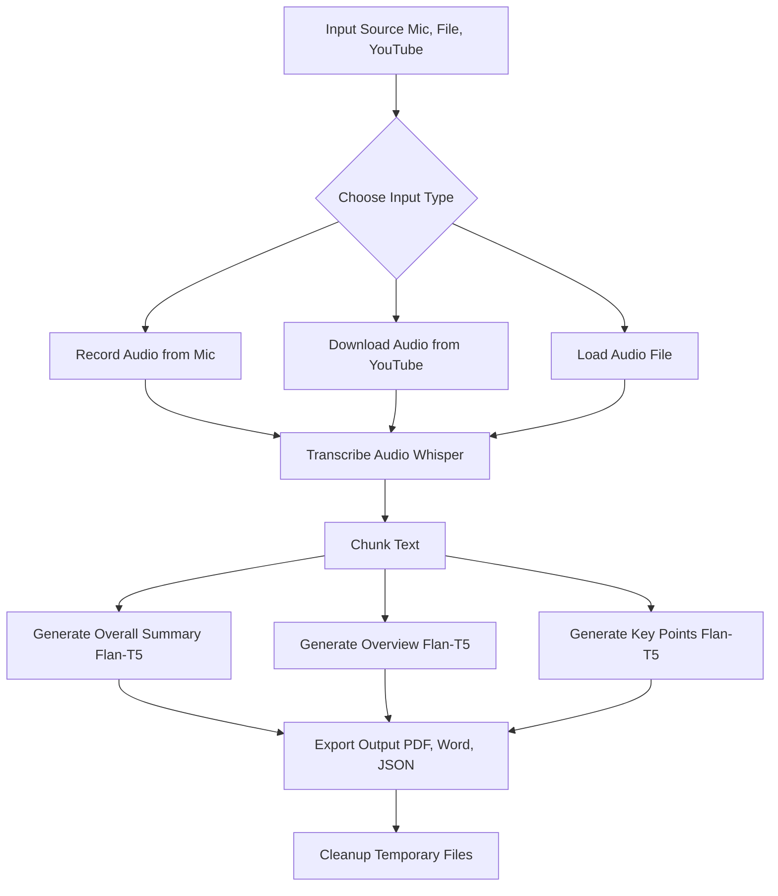

# lecture4.py

> **Source File:** [lecture4.py](https://github.com/test-company-prowiz/Note-Summerizer/blob/main/lecture4.py)
> **Repository:** `Note-Summerizer`
> **Branch:** `main`

# lecture4.py

### Overview
This file provides a comprehensive set of functionalities for processing audio and text, specifically tailored for transcribing audio (from microphone, local file, or YouTube), summarizing the transcript, extracting key points, and exporting the results into various formats (PDF, Word, JSON). It integrates multiple external libraries to achieve its purpose.

### Architecture & Role
Architecturally, this file acts as a standalone utility module or a core processing layer within a larger system. It orchestrates complex tasks involving audio I/O, machine learning model inference (transcription and summarization), and document generation. It does not expose a web interface or an API directly but provides a `process_input` function that serves as a high-level entry point for its functionality.

### Key Components
*   `samplerate`: Global configuration for audio recording sample rate.
*   `summarizer_pipeline`: A Hugging Face `transformers` pipeline initialized with `google/flan-t5-large` for text summarization.
*   `record_audio(duration, filename)`: Captures audio from the microphone and saves it as a WAV file.
*   `transcribe_audio(file_path)`: Uses the Whisper "medium" model to convert an audio file's content into text.
*   `transcribe_youtube(youtube_url)`: Downloads audio from a YouTube URL, converts it to MP3, and then transcribes it.
*   `chunk_text(text, max_words)`: Splits large texts into smaller chunks to accommodate model input limits.
*   `generate_summary(text)`: Creates an overall summary of the input text using the `summarizer_pipeline`.
*   `generate_key_points(text)`: Extracts bulleted key points from the input text using the `summarizer_pipeline` with a specific prompt.
*   `export_to_pdf(summary, overview, keypoints)`: Generates a PDF document with the processed information.
*   `export_to_word(summary, overview, keypoints)`: Generates a Word document with the processed information.
*   `export_to_json(summary, overview, keypoints)`: Exports the processed information into a JSON file.
*   `process_input(source_type, file_path, youtube_url, duration, export_format)`: The main orchestration function that handles the end-to-end workflow from audio input to exported summary.

### Execution Flow / Behavior
The `process_input` function serves as the primary entry point for the file's functionality.
1.  **Input Acquisition**: It determines the audio source:
    *   If `source_type` is "mic", it calls `record_audio` to capture live audio.
    *   If `source_type` is "file", it uses the provided `file_path`.
    *   If `source_type` is "youtube", it calls `transcribe_youtube` to download and process audio from a URL.
2.  **Transcription**: The acquired audio (or downloaded YouTube audio) is then passed to `transcribe_audio` for text conversion using the Whisper model.
3.  **Text Processing**: The full transcript is used to:
    *   Generate an `overall_summary` using `generate_summary`.
    *   Generate a brief `overview` by summarizing the initial part of the transcript.
    *   Generate bulleted `keypoints` using `generate_key_points`.
    *   Text is chunked via `chunk_text` before summarization to fit model context windows.
4.  **Export**: Based on the `export_format` parameter, the summary, overview, and key points are exported to a PDF, Word, or JSON file using the respective `export_to_pdf`, `export_to_word`, or `export_to_json` functions.
5.  **Cleanup**: Any temporary audio files created during the process (e.g., from microphone recording or YouTube download) are removed.
6.  **Return**: The function returns a dictionary containing the generated summaries, key points, and the path to the output file, or an error message if an exception occurs.

### Dependencies
*   `os`: Used for file system operations, specifically for cleaning up temporary audio files.
*   `json`: Utilized for serializing processed data into JSON format for export.
*   `whisper`: An external library for robust audio transcription. It loads the "medium" pre-trained model.
*   `sounddevice`: Facilitates recording audio from the system's microphone.
*   `scipy.io.wavfile`: Used in conjunction with `sounddevice` to write the recorded audio to a WAV file.
*   `transformers`: Provides the `pipeline` abstraction, specifically for the `google/flan-t5-large` summarization model.
*   `fpdf`: A library for generating PDF documents, used for exporting summaries.
*   `docx`: A library for creating and modifying Microsoft Word (`.docx`) files, used for exporting summaries.
*   `yt_dlp`: Used for downloading audio streams from YouTube URLs.

### Design Notes
*   **Modularity**: The functionality is broken down into distinct functions (record, transcribe, chunk, summarize, export), which promotes reusability and easier maintenance.
*   **Chunking Strategy**: Text is chunked by sentences, attempting to keep chunks under a specified word limit (`max_words=1000`). This is crucial for handling large transcripts and fitting them into the context window of the `flan-t5-large` summarization model.
*   **Model Selection**: The use of Whisper's "medium" model suggests a balance between accuracy and computational resources for transcription. `flan-t5-large` is chosen for summarization, indicating a preference for a powerful, general-purpose summarization model.
*   **Error Handling**: Basic `try-except` blocks are implemented in key functions like `record_audio`, `transcribe_audio`, `transcribe_youtube`, and `process_input` to catch and report errors gracefully.
*   **Temporary File Management**: The `process_input` function includes logic to remove temporary audio files (`mic_output.wav`, `yt_audio.mp3`) after processing, preventing disk clutter.
*   **Export Flexibility**: Multiple export formats (PDF, Word, JSON) are supported, providing users with choice depending on their integration needs.

### Diagram

```mermaid
graph TD
InputSource[Input Source Mic, File, YouTube] --> ChooseInputType{Choose Input Type}
ChooseInputType --> MicRecord[Record Audio from Mic]
ChooseInputType --> YouTubeDownload[Download Audio from YouTube]
ChooseInputType --> FileLoad[Load Audio File]

MicRecord --> TranscribeAudio[Transcribe Audio Whisper]
YouTubeDownload --> TranscribeAudio
FileLoad --> TranscribeAudio

TranscribeAudio --> ChunkText[Chunk Text]
ChunkText --> GenerateSummary[Generate Overall Summary Flan-T5]
ChunkText --> GenerateOverview[Generate Overview Flan-T5]
ChunkText --> GenerateKeyPoints[Generate Key Points Flan-T5]

GenerateSummary --> ExportOutput[Export Output PDF, Word, JSON]
GenerateOverview --> ExportOutput
GenerateKeyPoints --> ExportOutput

ExportOutput --> CleanupTempFiles[Cleanup Temporary Files]
```