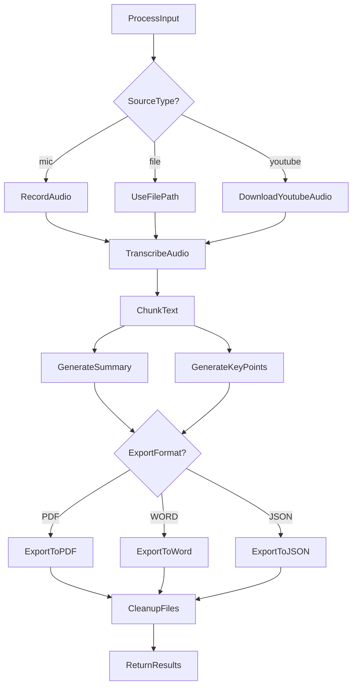

# lecture4.py

> **Source File:** [lecture4.py](https://github.com/test-company-prowiz/Note-Summerizer/blob/main/lecture4.py)
> **Repository:** `Note-Summerizer`
> **Branch:** `main`

# lecture4.py

### Overview
This file provides a comprehensive set of functionalities for processing audio inputs, transcribing them into text, generating summaries and key points, and exporting the results into various document formats. It supports audio input from a microphone, local files, or YouTube URLs.

### Architecture & Role
This file acts as a standalone utility module, integrating various third-party libraries for audio processing, natural language processing (NLP), and document generation. Architecturally, it sits as a processing layer that consumes raw audio data and produces structured textual outputs and formatted documents. It leverages pre-trained machine learning models for transcription and summarization.

### Key Components
*   **`samplerate`**: Global configuration for audio recording sample rate (44100 Hz).
*   **`summarizer_pipeline`**: A pre-initialized Hugging Face `transformers` pipeline using the `google/flan-t5-large` model for text summarization.
*   **`record_audio(duration, filename)`**: Records audio from the default microphone for a specified duration and saves it as a WAV file.
*   **`transcribe_audio(file_path)`**: Transcribes an audio file into text using the Whisper "medium" model.
*   **`transcribe_youtube(youtube_url)`**: Downloads audio from a YouTube URL, then transcribes it.
*   **`chunk_text(text, max_words)`**: Splits a large block of text into smaller chunks based on a maximum word limit, primarily to accommodate model input constraints.
*   **`generate_summary(text)`**: Generates a concise summary of the input text by processing it in chunks through the `summarizer_pipeline`.
*   **`generate_key_points(text)`**: Extracts key points from the input text, formatted as bullet points, using the `summarizer_pipeline` with a specific prompt.
*   **`export_to_pdf(summary, overview, keypoints)`**: Exports the generated summary, overview, and key points into a PDF document.
*   **`export_to_word(summary, overview, keypoints)`**: Exports the generated summary, overview, and key points into a Microsoft Word (`.docx`) document.
*   **`export_to_json(summary, overview, keypoints)`**: Exports the generated summary, overview, and key points into a JSON file.
*   **`process_input(source_type, file_path, youtube_url, duration, export_format)`**: The main orchestration function that handles the entire workflow from input source selection to final export and temporary file cleanup.

### Execution Flow / Behavior
The `process_input` function serves as the primary entry point, orchestrating the following sequence:
1.  **Input Source Handling**:
    *   If `source_type` is "mic", it records audio using `record_audio`.
    *   If `source_type` is "file", it uses the provided `file_path`.
    *   If `source_type` is "youtube", it downloads audio from the `youtube_url` using `yt_dlp` and saves it temporarily.
2.  **Transcription**: The obtained audio (recorded, local file, or downloaded) is transcribed into text using `transcribe_audio`.
3.  **Text Processing**: The full transcript is then used to:
    *   Generate an overall summary via `generate_summary`.
    *   Generate a brief overview (from the first 1000 characters of the transcript) via `generate_summary`.
    *   Extract key points via `generate_key_points`.
4.  **Export**: Based on the `export_format` parameter ("PDF", "WORD", "JSON"), the processed text is exported using the corresponding `export_to_pdf`, `export_to_word`, or `export_to_json` function.
5.  **Cleanup**: Any temporary audio files generated during the process (e.g., from mic recording or YouTube download) are removed.
6.  **Result**: The function returns a dictionary containing the generated summaries, key points, and the path to the output file, or an error message if an exception occurs.

### Dependencies
*   **`os`**: Used for file system operations, specifically for cleaning up temporary audio files.
*   **`json`**: Used for serializing the processed output into JSON format.
*   **`whisper`**: An external library for robust speech-to-text transcription. It loads the "medium" pre-trained model.
*   **`sounddevice`**: Provides an interface for recording audio from the microphone.
*   **`scipy.io.wavfile`**: Used to write recorded audio data into a WAV file format.
*   **`transformers`**: Hugging Face's library for state-of-the-art NLP models. It's used to load and run the `google/flan-t5-large` model for summarization.
*   **`fpdf`**: A library for generating PDF documents.
*   **`docx`**: A library for creating and updating Microsoft Word (`.docx`) files.
*   **`yt_dlp`**: A command-line program to download videos and audio from YouTube and other video sites.

### Design Notes
*   **Modularity**: The functionality is broken down into distinct functions for recording, transcription, chunking, summarization, and export, promoting code organization and reusability.
*   **Model Selection**: The choice of Whisper "medium" and Flan-T5-large indicates a preference for balanced performance and accuracy for transcription and summarization, respectively.
*   **Text Chunking**: The `chunk_text` function addresses the common limitation of transformer models regarding input sequence length, enabling processing of longer transcripts.
*   **Multiple Export Formats**: Providing PDF, Word, and JSON export options enhances the utility and flexibility of the tool for different user needs.
*   **Error Handling**: Basic `try-except` blocks are implemented to catch exceptions during various stages of processing, returning error messages.
*   **Temporary File Management**: The `cleanup_files` list and `os.remove` ensure that temporary audio files are deleted after processing, preventing disk clutter.

### Diagram

```mermaid
graph TD
A[ProcessInput] --> B{SourceType?}
B -- mic --> C[RecordAudio]
B -- file --> D[UseFilePath]
B -- youtube --> E[DownloadYoutubeAudio]
C --> F[TranscribeAudio]
D --> F
E --> F
F --> G[ChunkText]
G --> H[GenerateSummary]
G --> I[GenerateKeyPoints]
H --> J{ExportFormat?}
I --> J
J -- PDF --> K[ExportToPDF]
J -- WORD --> L[ExportToWord]
J -- JSON --> M[ExportToJSON]
K --> N[CleanupFiles]
L --> N
M --> N
N --> O[ReturnResults]
```