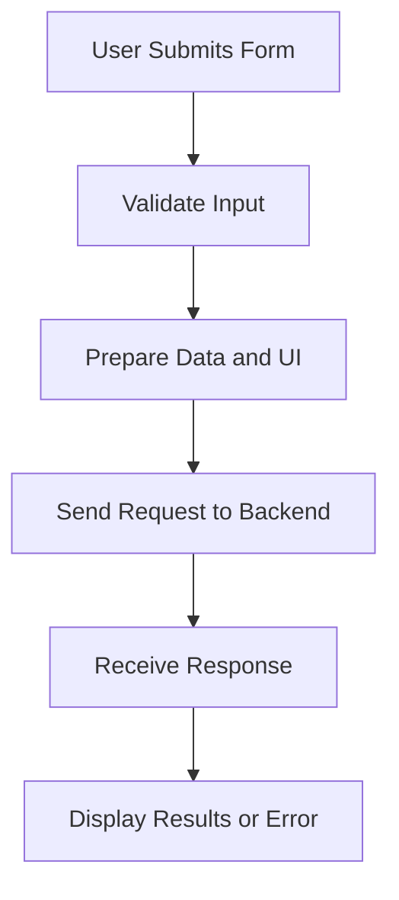

# script.js

> **Source File:** [script.js](https://github.com/Note-Summerizer/blob/main/script.js)  
> **Repository:** `Note-Summerizer`  
> **Branch:** `main`

### Overview
This file implements the client-side logic for a web application that interacts with a backend summarization service. It handles user input for specifying input type (YouTube URL or file upload), submitting requests to the backend, displaying processing feedback, and presenting the summarization results in a chat-like interface. It also manages UI elements like theme toggling and clearing chat history.

### Architecture & Role
This JavaScript file functions as a core component of the frontend client. It operates within the browser's execution environment, managing the user interface, capturing user interactions, and orchestrating asynchronous communication with a dedicated backend API. It sits at the presentation layer, bridging user actions with data processing performed by the backend.

### Key Components
*   **`chatsContainer`**: A DOM element that serves as the display area for chat-style messages, including user prompts, processing statuses, and backend summaries.
*   **`promptForm`**: The main HTML form responsible for capturing user input for summarization requests.
*   **`inputType`**: A select element that controls whether a YouTube URL input or a file upload input is displayed and determines the type of data sent to the backend.
*   **`youtubeInput`**: An input field for users to provide a YouTube video URL for summarization.
*   **`fileInput`**: An input field for users to upload an audio file for summarization.
*   **`themeToggleBtn`**: A button that allows users to switch between light and dark themes, with the preference stored in `localStorage`.
*   **`deleteChatsBtn`**: A button that clears all displayed messages from the `chatsContainer`.
*   **`BACKEND_URL`**: A constant defining the API endpoint for the summarization service (`http://127.0.0.1:5000/summarize`).
*   **`showResultBlock(title, content, type)`**: A utility function to create and append a new message block to the `chatsContainer`, styling it based on the `type` parameter.

### Execution Flow / Behavior
Upon loading, the script initializes by selecting various DOM elements.
*   **Input Type Toggle**: An event listener on `inputType` dynamically shows or hides the `youtubeInput` or `fileInput` field based on the selected input type.
*   **Form Submission**: When `promptForm` is submitted:
    *   It prevents the default form submission.
    *   The `chatsContainer` is cleared.
    *   Input values (selected type, format, YouTube URL, or file) are validated.
    *   A `FormData` object is constructed, including the input type, export format, and either the YouTube URL, the uploaded file, or a placeholder duration for a "mic" input (though "mic" input handling isn't fully implemented).
    *   A "Processing Input..." message is displayed.
    *   An asynchronous POST request is sent to `BACKEND_URL` with the `FormData`.
    *   Upon receiving a response:
        *   The "Processing" message is cleared.
        *   If the response contains an `error` field, an error message is displayed.
        *   Otherwise, the overall summary, overview, key points, and output file name from the backend response are displayed as distinct chat blocks.
        *   Network or server errors during the fetch operation are caught and displayed as "Server Error" messages.
*   **Theme Toggle**: Clicking `themeToggleBtn` toggles the `light-theme` class on the `document.body` and updates `localStorage` to persist the user's theme preference. The button's text also changes to reflect the current theme.
*   **Delete Chats**: Clicking `deleteChatsBtn` clears all content from `chatsContainer` and removes the `chats-active` class from `document.body`.

### Dependencies
*   **Internal**:
    *   Direct DOM manipulation via `document.querySelector` and `document.createElement`.
    *   Uses browser's `localStorage` for persisting theme settings.
    *   Relies on the presence of `frenzy.svg` for avatar images in chat messages.
*   **External**:
    *   Requires a backend API endpoint at `http://127.0.0.1:5000/summarize` to process summarization requests. This backend is expected to return JSON data containing `overall_summary`, `overview`, `keypoints`, and `output_file` on success, or an `error` field on failure.

### Design Notes
*   The UI updates rely on direct manipulation of the DOM (`innerHTML`, `classList`, `style.display`).
*   Asynchronous operations for backend communication are handled using the `fetch` API with `async/await`.
*   Error handling for backend responses and network issues is implemented to provide user feedback.
*   Client-side validation is performed for required input fields before sending requests.
*   The "mic" input type is present in the `FormData` construction but lacks corresponding UI elements or specific logic for acquiring microphone input.

### Diagram (Optional)
