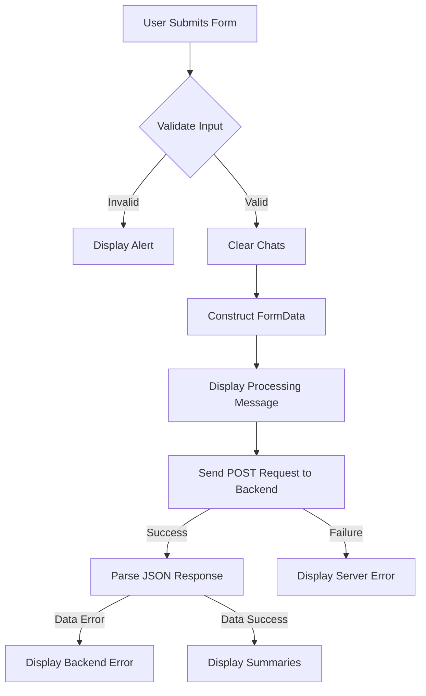

# script.js

### Overview
This file implements the client-side user interface logic for a web application. It handles user input selection (YouTube link, audio file), submission of data to a backend summarization service, and dynamic display of results or error messages in a chat-like interface. It also manages theme toggling and clearing chat history.

### Architecture & Role
This script functions as the primary frontend client-side component. It operates within the browser's execution environment, directly manipulating the Document Object Model (DOM) to manage user interactions and display dynamic content. Architecturally, it sits at the presentation layer and acts as the consumer of a backend API located at `http://127.0.0.1:5000/summarize`.

### Key Components
*   **DOM Element References**: Various `const` variables (`chatsContainer`, `promptForm`, `inputType`, `youtubeInput`, `fileInput`, `themeToggleBtn`, `deleteChatsBtn`, `exportFormat`) store references to specific HTML elements, enabling their manipulation.
*   **`BACKEND_URL`**: A constant string defining the endpoint for the backend summarization service.
*   **`showResultBlock(title, content, type)` Function**: A utility function responsible for dynamically creating and appending styled message blocks to the `chatsContainer`. It handles setting content, styling (e.g., `bot-message`), and scrolling the new message into view.
*   **`inputType` Change Listener**: Toggles the display style (block/none) of `youtubeInput` or `fileInput` elements based on the currently selected input type.
*   **`promptForm` Submission Listener**:
    *   Prevents default form submission.
    *   Clears existing chat content.
    *   Performs client-side validation for selected input type, YouTube URL, or file presence.
    *   Constructs a `FormData` object containing the selected input type, export format, and either a YouTube URL or an audio file.
    *   Displays a "Processing Input" message.
    *   Sends an asynchronous `POST` request to the `BACKEND_URL` using the `fetch` API.
    *   Parses the JSON response from the backend.
    *   Clears the processing message and displays either an error or the summary results (overall summary, overview, key points, export file information).
    *   Handles network errors during the fetch operation.
*   **`themeToggleBtn` Click Listener**: Toggles the `light-theme` class on the `document.body` element, persists the theme choice in `localStorage`, and updates the button's text content.
*   **`deleteChatsBtn` Click Listener**: Clears all message blocks from `chatsContainer` and removes the `chats-active` class from `document.body`.

### Execution Flow / Behavior
Upon page load, the script initializes by selecting various DOM elements. It then sets up event listeners for user interactions.
When the `inputType` selection changes, the visibility of the YouTube URL input or the file upload input is dynamically adjusted.
When the `promptForm` is submitted, client-side validation occurs. If valid, a processing message is shown, and the form data is sent to the backend. The script awaits the backend response, then clears the processing message and populates the chat container with the returned summary data or an error message.
User actions on the theme toggle button switch the visual theme of the application and store this preference locally. The delete chats button clears the displayed chat history. The `showResultBlock` function is called throughout to render dynamic content in a consistent chat message format, ensuring new messages scroll into view.

### Dependencies
*   **Browser DOM API**: Used for selecting elements (`document.querySelector`), manipulating classes (`classList`), creating elements (`document.createElement`), and updating element styles (`style.display`).
*   **`fetch` API**: Utilized for making asynchronous HTTP requests to the backend server.
*   **`FormData` API**: Used to construct data for `POST` requests, supporting file uploads and key-value pairs.
*   **`localStorage` API**: Used to persist user preferences, specifically the chosen theme.
*   **Backend Summarization Service**: An external service (expected at `http://127.0.0.1:5000/summarize`) that processes the submitted data and returns summarized content.

### Design Notes
*   **Client-Side Validation**: Basic input validation is performed on the client before sending data to the backend, reducing unnecessary network requests for invalid input.
*   **Dynamic UI**: The UI adapts based on user selections (e.g., input type) and processing status (e.g., "Processing Input..." message).
*   **Direct DOM Manipulation**: The script directly manipulates the DOM to render messages, which is suitable for this specific component's scope.
*   **Asynchronous Operations**: Uses `async/await` with the `fetch` API for non-blocking communication with the backend.
*   **Error Handling**: Includes `try...catch` blocks for network requests and checks `data.error` from the backend response to display user-friendly error messages.
*   **Theme Persistence**: Uses `localStorage` to remember the user's selected theme across sessions.

### Diagram (Optional)
