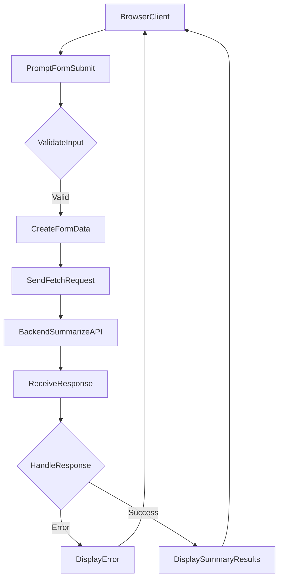

# script.js

> **Source File:** [script.js](https://github.com/test-company-prowiz/Note-Summerizer/blob/main/script.js)
> **Repository:** `Note-Summerizer`
> **Branch:** `main`

# script.js

### Overview
This file implements the client-side logic for a content summarization application. It manages user interface interactions, handles form submissions for summarization requests (via YouTube URL, audio file, or microphone), communicates with a backend API, and displays the processed results in a chat-like format. It also includes UI features such as theme toggling and clearing chat history.

### Architecture & Role
This file operates as the primary client-side component within a client-server architecture. It resides in the presentation layer, directly interacting with the Document Object Model (DOM) to render the user interface and capture user input. Its main role is to facilitate user interaction and forward summarization requests to the designated backend service.

### Key Components
*   **`showResultBlock(title, content, type)`**: A utility function responsible for dynamically creating and appending message blocks to the chat container, displaying prompts, processing statuses, errors, or summarization results.
*   **`promptForm` Event Listener**: Manages the form submission process. It extracts user input, performs client-side validation, constructs `FormData`, dispatches asynchronous `POST` requests to the backend, and handles displaying responses or errors.
*   **`inputType` Change Listener**: Controls the visibility of input fields (YouTube link or file upload) based on the user's selected input type, ensuring a dynamic user experience.
*   **`themeToggleBtn` Click Listener**: Toggles the application's visual theme (light/dark mode) by manipulating CSS classes on the `body` element and persisting the preference in `localStorage`.
*   **`deleteChatsBtn` Click Listener**: Clears all displayed chat messages from the `chatsContainer` and resets the UI state.

### Execution Flow / Behavior
1.  Upon page load, the script selects various DOM elements.
2.  The `inputType` change event dynamically shows/hides the YouTube URL or audio file input fields.
3.  When the `promptForm` is submitted:
    *   Default form submission is prevented.
    *   Previous chat content is cleared.
    *   Input values (`selected` type, `format`, `youtubeURL`, `file`) are extracted and validated.
    *   A `FormData` object is populated based on the selected input type.
    *   A "Processing Input..." message is displayed in the chat.
    *   An asynchronous `POST` request is sent to `BACKEND_URL` (`/summarize`).
    *   The response is parsed as JSON. If an error is present, it's displayed. Otherwise, the `overall_summary`, `overview`, `keypoints`, and `output_file` are displayed sequentially using `showResultBlock`.
    *   Network or server errors during the `fetch` operation are caught and displayed.
4.  Clicking `themeToggleBtn` switches the `body`'s `light-theme` class, updates the button text, and saves the theme preference to `localStorage`.
5.  Clicking `deleteChatsBtn` clears all messages from the `chatsContainer` and removes the `chats-active` class from the `body`.

### Dependencies
*   **Internal:**
    *   The HTML structure (for `chatsContainer`, `promptForm`, input elements, buttons) that this script interacts with via DOM queries.
    *   `frenzy.svg` for the avatar image displayed in chat messages.
    *   Associated CSS styles for visual presentation, including `message`, `bot-message`, `light-theme`, and `chats-active` classes.
*   **External:**
    *   A backend service accessible at `http://127.0.0.1:5000/summarize` for performing the actual summarization.
    *   The `fetch` API for making HTTP requests to the backend.
    *   The `localStorage` API for persisting user theme preferences.

### Design Notes
The implementation uses direct DOM manipulation to update the user interface, which is suitable for this level of application complexity. Client-side input validation is performed before sending requests to the backend, reducing unnecessary server load. The asynchronous `fetch` API ensures the UI remains responsive during backend processing. The `mic` input type is referenced in the form data append logic, though its corresponding UI input field is not directly visible or toggled by the existing `inputType` change listener, suggesting it might be a future or incomplete feature.

### Diagram

```mermaid
graph TD
A[BrowserClient] --> B[PromptFormSubmit]
B --> C{ValidateInput}
C -- Valid --> D[CreateFormData]
D --> E[SendFetchRequest]
E --> F[BackendSummarizeAPI]
F --> G[ReceiveResponse]
G --> H{HandleResponse}
H -- Error --> I[DisplayError]
H -- Success --> J[DisplaySummaryResults]
I --> A
J --> A
```