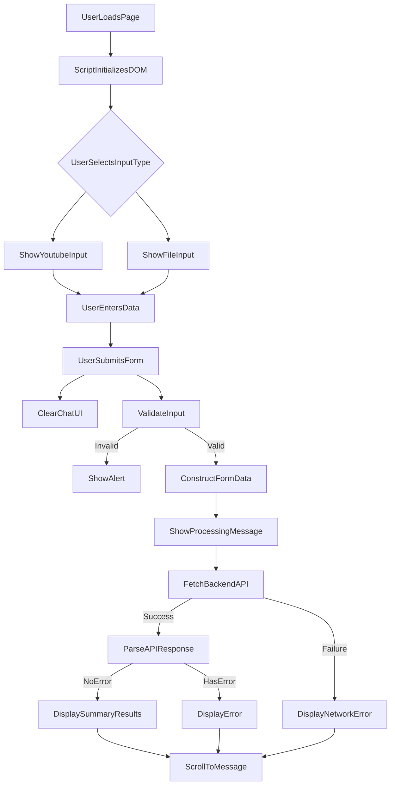

# script.js

> **Source File:** [script.js](https://github.com/test-company-prowiz/Note-Summerizer/blob/main/script.js)
> **Repository:** `Note-Summerizer`
> **Branch:** `main`

# script.js

### Overview
This file implements the client-side logic for a web application that facilitates content summarization. It manages user interface interactions, form submissions, and communication with a backend summarization API.

### Architecture & Role
This script operates within the browser as a frontend client component. It is responsible for rendering the user interface, capturing user input, making API requests to a backend service, and displaying the results. It belongs to the presentation layer, handling direct user interaction and data flow to and from the backend.

### Key Components
*   **DOM Element Selectors**: Variables like `chatsContainer`, `promptForm`, `inputType`, `exportFormat`, `youtubeInput`, `fileInput`, `themeToggleBtn`, and `deleteChatsBtn` cache references to key UI elements.
*   **`BACKEND_URL`**: A constant defining the target endpoint for the summarization API (`http://127.0.0.1:5000/summarize`).
*   **`showResultBlock(title, content, type)`**: A utility function to dynamically create and append message blocks to the `chatsContainer`, simulating a chat interface.
*   **Event Listeners**:
    *   `inputType.addEventListener("change", ...)`: Toggles visibility of input fields based on the selected content source (YouTube link or audio file).
    *   `promptForm.addEventListener("submit", async (e) => ...)`: Handles the form submission for summarization requests, including input validation, `FormData` construction, API invocation, and result display.
    *   `themeToggleBtn.addEventListener("click", ...)`: Manages the application's theme (light/dark mode) and persistence in `localStorage`.
    *   `deleteChatsBtn.addEventListener("click", ...)`: Clears all displayed chat messages.

### Execution Flow / Behavior
1.  **Initialization**: Upon page load, the script selects various DOM elements and defines the backend API URL.
2.  **Input Type Selection**: When the user changes the `inputType` dropdown, the script dynamically shows either the YouTube URL input or the file upload input field.
3.  **Form Submission**:
    *   When the `promptForm` is submitted, the event is prevented from default browser handling.
    *   Previous chat messages are cleared from `chatsContainer`.
    *   Client-side validation checks if an input type, export format, and the corresponding input (YouTube URL or file) are provided.
    *   A `FormData` object is constructed, including `input_type`, `export_format`, and either `youtube_url` or the `file` itself. A `duration` parameter is also appended for "mic" input type, though "mic" input UI is not present.
    *   A "Processing Input..." message is displayed using `showResultBlock`.
    *   An asynchronous `POST` request is sent to `BACKEND_URL` with the `FormData`.
    *   Upon receiving a response, the `chatsContainer` is cleared again.
    *   If the backend response contains an `error` field, an error message is displayed.
    *   Otherwise, the overall summary, overview, key points, and output file information received from the backend are displayed as distinct chat blocks.
    *   Network or parsing errors during the `fetch` operation are caught and displayed as a "Server Error".
4.  **Theme Toggling**: Clicking the `themeToggleBtn` toggles the `light-theme` class on the `document.body` element, updates `localStorage` to persist the theme choice, and changes the button text.
5.  **Chat Deletion**: Clicking the `deleteChatsBtn` clears all messages from the `chatsContainer` and removes the `chats-active` class from the body.

### Dependencies
*   **Browser DOM APIs**: Relies heavily on standard browser APIs for DOM manipulation (`document.querySelector`, `createElement`, `appendChild`, `classList`, `scrollIntoView`), event handling (`addEventListener`), network requests (`fetch`, `FormData`), and local storage (`localStorage`).
*   **Backend Service**: Has a hardcoded dependency on a backend API exposed at `http://127.0.0.1:5000/summarize` for processing summarization requests.

### Design Notes
*   **Direct DOM Manipulation**: The script directly manipulates the DOM to update the UI, which can lead to maintainability challenges in larger applications.
*   **Hardcoded Backend URL**: The `BACKEND_URL` is hardcoded, making it less flexible for deployment across different environments without code changes.
*   **Client-side Validation**: Basic input validation is performed before sending requests to the backend, reducing unnecessary network traffic.
*   **User Experience**: Includes features like dynamic input field visibility, theme toggling, and automatic scrolling to new messages to improve user interaction.
*   **Input Type Handling**: Supports different input types (YouTube, file, with a placeholder for "mic") which are differentiated through `FormData`.

### Diagram 

```mermaid
graph TD
A[UserLoadsPage] --> B[ScriptInitializesDOM]
B --> C{UserSelectsInputType}
C --> D1[ShowYoutubeInput]
C --> D2[ShowFileInput]
D1 --> E[UserEntersData]
D2 --> E[UserEntersData]
E --> F[UserSubmitsForm]
F --> G[ClearChatUI]
F --> H[ValidateInput]
H -- Invalid --> I[ShowAlert]
H -- Valid --> J[ConstructFormData]
J --> K[ShowProcessingMessage]
K --> L[FetchBackendAPI]
L -- Success --> M[ParseAPIResponse]
M -- HasError --> N[DisplayError]
M -- NoError --> O[DisplaySummaryResults]
L -- Failure --> P[DisplayNetworkError]
O --> Q[ScrollToMessage]
N --> Q[ScrollToMessage]
P --> Q[ScrollToMessage]
```