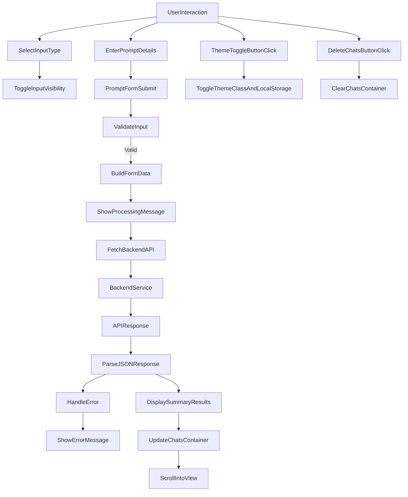

# script.js

> **Source File:** [script.js](https://github.com/test-company-prowiz/Note-Summerizer/blob/main/script.js)
> **Repository:** `Note-Summerizer`
> **Branch:** `main`

# script.js

### Overview
This file implements the client-side logic for a web application designed to summarize content from various sources (YouTube links, audio files, or microphone input). It manages user interface interactions, handles form submissions, communicates with a backend summarization service, and displays the results in a chat-like format.

### Architecture & Role
This file operates within the presentation layer, specifically as a client-side JavaScript module. Its role is to bridge user interactions with the backend API, acting as the primary controller for the user interface and data flow from the browser to the summarization service. It does not contain server-side logic or persistent data storage mechanisms beyond local theme preferences.

### Key Components
*   **DOM Element Selectors**: Variables like `chatsContainer`, `promptForm`, `inputType`, `youtubeInput`, `fileInput`, `themeToggleBtn`, and `deleteChatsBtn` reference specific HTML elements for manipulation and event handling.
*   **`BACKEND_URL`**: A constant defining the endpoint for the backend summarization service (`http://127.0.0.1:5000/summarize`).
*   **`showResultBlock(title, content, type)`**: A utility function responsible for dynamically creating and appending message blocks to the `chatsContainer`, displaying user input, processing messages, or summary results.
*   **Event Listeners**:
    *   `inputType.addEventListener("change", ...)`: Controls the visibility of input fields (YouTube URL or file upload) based on the selected input type.
    *   `promptForm.addEventListener("submit", async (e) => ...)`: Handles the form submission, including input validation, `FormData` creation, API request to the backend, and rendering of responses or errors.
    *   `themeToggleBtn.addEventListener("click", ...)`: Toggles the `light-theme` class on the `<body>` element and stores the theme preference in `localStorage`.
    *   `deleteChatsBtn.addEventListener("click", ...)`: Clears all displayed messages from the `chatsContainer`.

### Execution Flow / Behavior
1.  **Initialization**: The script selects necessary DOM elements upon loading.
2.  **Input Type Selection**: When the user changes the `inputType` dropdown, the script dynamically shows or hides the `youtubeInput` or `fileInput` fields.
3.  **Form Submission**:
    *   Upon `promptForm` submission, default form behavior is prevented.
    *   The `chatsContainer` is cleared.
    *   Input type, export format, and relevant input data (YouTube URL or file) are retrieved and validated.
    *   A `FormData` object is constructed with the selected options and data.
    *   A "Processing Input..." message is displayed using `showResultBlock`.
    *   An asynchronous `POST` request is sent to the `BACKEND_URL` with the `FormData`.
    *   The response from the backend is parsed as JSON.
    *   If the response contains an `error` field, an error message is displayed.
    *   Otherwise, summary details (`overall_summary`, `overview`, `keypoints`, `output_file`) are displayed using `showResultBlock`.
    *   Error handling for network issues or failed backend connections is implemented via a `try-catch` block.
4.  **Theme Toggling**: Clicking `themeToggleBtn` switches between `light-theme` and default (dark) theme, updating the button text and `localStorage`.
5.  **Chat Deletion**: Clicking `deleteChatsBtn` clears all messages from the `chatsContainer` and removes the `chats-active` class from the `<body>`.

### Dependencies
*   **Internal**:
    *   **HTML Structure**: Relies on specific DOM elements with classes (`.chats-container`, `.prompt-form`, `.message`, etc.) and IDs (`#input-type`, `#export-format`, `#youtube-link`, `#audio-file`, `#theme-toggle-btn`, `#delete-chats-btn`) to function correctly.
    *   **CSS Styles**: Assumes the presence of CSS rules for classes like `.message`, `.bot-message`, `.user-message`, `.chats-active`, and `.light-theme` to manage visual presentation.
*   **External**:
    *   **Backend API**: Requires a running backend service at `http://127.0.0.1:5000/summarize` that accepts `POST` requests with `FormData` and returns a JSON object containing summary data or an error message.

### Design Notes
*   **Direct DOM Manipulation**: The script directly queries and manipulates the DOM for rendering and event handling. For larger applications, a framework-based approach might offer better maintainability.
*   **Client-Side Validation**: Basic input validation (presence of URL/file) is performed client-side, enhancing user experience by providing immediate feedback.
*   **Backend Coupling**: The `BACKEND_URL` is hardcoded, coupling the frontend directly to a specific local backend instance.
*   **Theme Persistence**: Theme preference is stored in `localStorage`, allowing the user's selection to persist across sessions.

### Diagram

```mermaid
graph TD
User[UserInteraction] --> SelectInput[SelectInputType]
User --> EnterPrompt[EnterPromptDetails]
SelectInput --> ToggleInputVisibility[ToggleInputVisibility]
EnterPrompt --> PromptForm[PromptFormSubmit]
PromptForm --> ValidateInput[ValidateInput]
ValidateInput -- Valid --> BuildFormData[BuildFormData]
BuildFormData --> ShowProcessing[ShowProcessingMessage]
ShowProcessing --> FetchBackend[FetchBackendAPI]
FetchBackend --> BackendService[BackendService]
BackendService --> Response[APIResponse]
Response --> ParseResponse[ParseJSONResponse]
ParseResponse --> HandleError[HandleError]
ParseResponse --> DisplaySummary[DisplaySummaryResults]
HandleError --> ShowError[ShowErrorMessage]
DisplaySummary --> UpdateUI[UpdateChatsContainer]
UpdateUI --> ScrollView[ScrollIntoView]

User --> ThemeToggleBtn[ThemeToggleButtonClick]
ThemeToggleBtn --> ToggleTheme[ToggleThemeClassAndLocalStorage]

User --> DeleteChatsBtn[DeleteChatsButtonClick]
DeleteChatsBtn --> ClearChats[ClearChatsContainer]
```