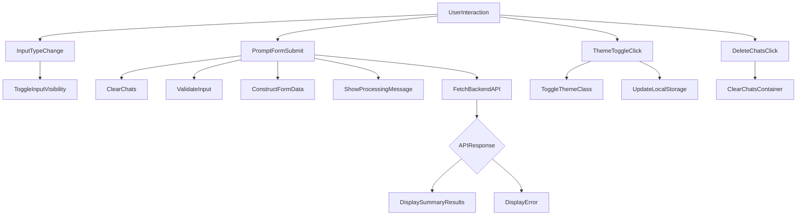

# script.js

> **Source File:** [script.js](https://github.com/test-company-prowiz/Note-Summerizer/blob/main/script.js)
> **Repository:** `Note-Summerizer`
> **Branch:** `main`

# script.js

### Overview
This file implements the client-side JavaScript logic for a web application that facilitates content summarization. It manages user interface interactions, handles form submissions for various input types (YouTube URL, audio file), and communicates with a backend API to retrieve and display summaries.

### Architecture & Role
`script.js` operates within the client-side (browser) layer of the application. It acts as the primary controller for the user interface, responsible for:
*   Responding to user input.
*   Dynamically updating the DOM.
*   Orchestrating API requests to the backend summarization service.

### Key Components
*   **DOM Element Selectors**: Variables like `chatsContainer`, `promptForm`, `inputType`, `youtubeInput`, `fileInput`, `themeToggleBtn`, and `deleteChatsBtn` are used to reference specific HTML elements for manipulation and event handling.
*   **`BACKEND_URL` Constant**: Defines the endpoint for the summarization service API.
*   **`showResultBlock(title, content, type)` Function**: A utility function to create and append styled message blocks (e.g., user prompts, bot responses, errors) to the `chatsContainer`.
*   **`inputType` Change Listener**: Toggles the visibility of either the YouTube URL input or the audio file input based on the user's selection.
*   **`promptForm` Submission Listener**: Handles the core logic for submitting summarization requests to the backend, including input validation, `FormData` construction, API `fetch` call, and rendering results or errors.
*   **`themeToggleBtn` Click Listener**: Manages the application's theme (light/dark mode) by toggling a CSS class on the `body` element and persisting the preference in `localStorage`.
*   **`deleteChatsBtn` Click Listener**: Clears all displayed chat messages from the `chatsContainer`.

### Execution Flow / Behavior
1.  **Initialization**: Upon page load, the script selects necessary DOM elements and defines the backend API URL.
2.  **Input Type Selection**: When the user changes the `inputType` dropdown, the script dynamically shows either the YouTube URL field or the audio file upload field, hiding the other.
3.  **Form Submission**:
    *   On `promptForm` submission, default form behavior is prevented.
    *   Previous chat messages are cleared.
    *   Input fields (e.g., YouTube URL, file upload) are validated based on the selected input type.
    *   A `FormData` object is constructed, including `input_type`, `export_format`, and the relevant input data (YouTube URL, audio file, or a placeholder for "mic" input).
    *   A "Processing Input" message is displayed in the chat area.
    *   An asynchronous `POST` request is sent to the `BACKEND_URL` with the `FormData`.
    *   Upon receiving a response, the processing message is cleared.
    *   If the response contains an `error` field, an error message is displayed.
    *   Otherwise, the overall summary, overview, key points, and export file information are displayed in separate chat blocks.
    *   Error handling for network issues or server failures is included.
4.  **Theme Toggling**: Clicking the `themeToggleBtn` switches the `body` element's class between `light-theme` and no class, updates the button text, and saves the theme preference to `localStorage`.
5.  **Chat Deletion**: Clicking the `deleteChatsBtn` empties the `chatsContainer` and removes the `chats-active` class from the `body`.

### Dependencies
*   **Web APIs**:
    *   `document.querySelector()`: For DOM element selection.
    *   `HTMLElement.addEventListener()`: For event handling.
    *   `fetch()`: For making HTTP requests to the backend.
    *   `FormData()`: For constructing multipart/form-data requests.
    *   `localStorage`: For client-side persistence of user preferences (theme).
    *   `setTimeout()`: For deferred scrolling behavior.
*   **Backend API**: Relies on an external backend service available at `http://127.0.0.1:5000/summarize` to process summarization requests.

### Design Notes
*   **Direct DOM Manipulation**: The script directly manipulates the DOM to update the UI, which is common for smaller client-side applications but can become complex in larger projects without a framework.
*   **Client-Side Validation**: Basic input validation is performed on the client side before submitting requests, improving user experience by providing immediate feedback.
*   **Single Backend Endpoint**: All summarization requests are directed to a single `/summarize` endpoint, with the `input_type` parameter differentiating the request type.
*   **State Management**: UI state (like `chats-active` class and theme preference) is managed directly via DOM classes and `localStorage`.

### Diagram

```mermaid
graph TD
A[UserInteraction] --> B[PromptFormSubmit]
A --> C[InputTypeChange]
A --> D[ThemeToggleClick]
A --> E[DeleteChatsClick]

C --> F[ToggleInputVisibility]

B --> G[ClearChats]
B --> H[ValidateInput]
B --> I[ConstructFormData]
B --> J[ShowProcessingMessage]
B --> K[FetchBackendAPI]
K --> L{APIResponse}
L --> M[DisplaySummaryResults]
L --> N[DisplayError]

D --> O[ToggleThemeClass]
D --> P[UpdateLocalStorage]

E --> Q[ClearChatsContainer]
```