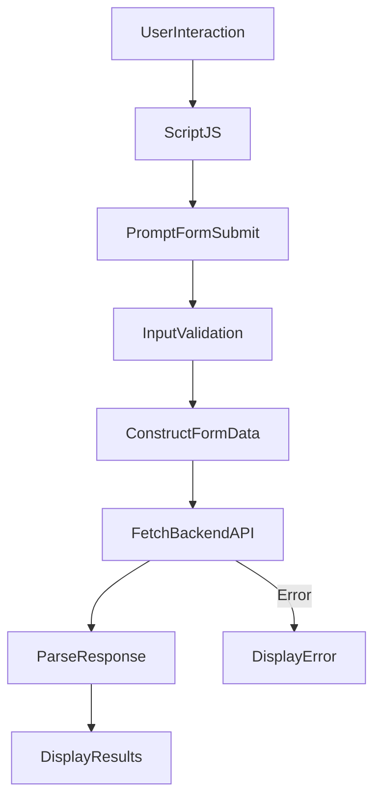

# script.js

> **Source File:** [script.js](https://github.com/test-company-prowiz/Note-Summerizer/blob/main/script.js)
> **Repository:** `Note-Summerizer`
> **Branch:** `main`

# script.js

### Overview
This file implements the client-side logic for a web application that interacts with a backend summarization service. It manages user interface elements, handles form submissions for various input types (YouTube links, audio files), displays processing feedback, and renders summary results or error messages.

### Architecture & Role
This JavaScript file operates entirely within the browser as part of the frontend layer. It is responsible for client-side UI manipulation, event handling, and orchestrating asynchronous communication with a backend API. It acts as the direct interface between the user and the summarization functionality provided by the server.

### Key Components
*   **DOM Element Selectors**: Variables like `chatsContainer`, `promptForm`, `inputType`, `youtubeInput`, `fileInput`, `themeToggleBtn`, and `deleteChatsBtn` cache references to key HTML elements for manipulation.
*   `BACKEND_URL`: A constant defining the endpoint for the summarization service.
*   `showResultBlock(title, content, type)`: A utility function to dynamically create and append chat-style message blocks to the `chatsContainer`, displaying user prompts, processing status, or backend responses.
*   **Event Listeners**:
    *   `inputType` change listener: Toggles the visibility of `youtubeInput` or `fileInput` based on the selected input method.
    *   `promptForm` submit listener: Handles form data submission to the backend, including input validation, `FormData` construction, `fetch` API calls, and result rendering.
    *   `themeToggleBtn` click listener: Toggles a `light-theme` class on the `body` element and persists the theme preference in `localStorage`.
    *   `deleteChatsBtn` click listener: Clears all messages from the `chatsContainer`.

### Execution Flow / Behavior
1.  **Initialization**: Upon page load, the script selects necessary DOM elements and attaches event listeners.
2.  **Input Type Selection**: When the user changes the `inputType` dropdown, the script dynamically shows either the YouTube URL input or the audio file upload input field.
3.  **Form Submission**:
    *   Upon `promptForm` submission, default form behavior is prevented.
    *   Existing chat messages are cleared.
    *   Input fields are validated based on the selected `inputType` and `exportFormat`.
    *   A `FormData` object is prepared, including `input_type`, `export_format`, and either `youtube_url` or the `file` itself.
    *   A "Processing Input..." message is displayed using `showResultBlock`.
    *   An asynchronous `POST` request is made to the `BACKEND_URL`.
    *   The response is parsed as JSON. If an error is returned or a network error occurs, an error message is displayed.
    *   If successful, the processing message is cleared, and the `overall_summary`, `overview`, `keypoints`, and `output_file` from the backend response are displayed as individual chat blocks.
4.  **Theme Toggling**: Clicking the `themeToggleBtn` applies or removes the `light-theme` class from the `body` element and updates the `themeColor` item in `localStorage`.
5.  **Chat Deletion**: Clicking the `deleteChatsBtn` clears the `chatsContainer` and removes the `chats-active` class from the `body`.

### Dependencies
*   **Internal**: Standard browser DOM APIs (`document.querySelector`, `addEventListener`, `createElement`, `fetch`, `localStorage`).
*   **External**:
    *   A backend API endpoint at `http://127.0.0.1:5000/summarize` for processing summarization requests.
    *   The `frenzy.svg` image, used as an avatar in chat messages.

### Design Notes
*   The backend URL is hardcoded, which might require modification for different deployment environments.
*   Client-side input validation provides immediate feedback but requires corresponding server-side validation for robustness.
*   The UI updates are direct DOM manipulations, which is suitable for this scale but could benefit from a framework for more complex applications.
*   Error handling is basic, displaying generic messages for network or server-side errors.
*   Theme preference is stored in `localStorage` for persistence across sessions.

### Diagram

```mermaid
graph TD
A[UserInteraction] --> B[ScriptJS]
B --> C[PromptFormSubmit]
C --> D[InputValidation]
D --> E[ConstructFormData]
E --> F[FetchBackendAPI]
F --> G[ParseResponse]
G --> H[DisplayResults]
F -- Error --> I[DisplayError]
```