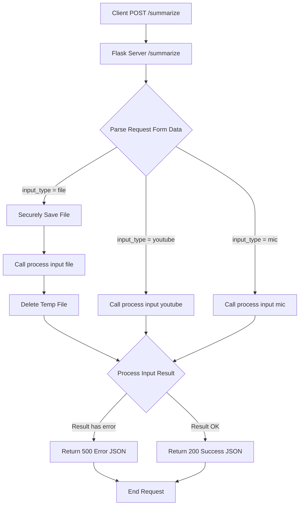

# server.py

### Overview
This file implements a Flask web server that provides an API endpoint for processing various types of input (file, YouTube URL, microphone audio) and generating output in a specified format. It acts as an orchestrator, delegating the core processing logic to an external module.

### Architecture & Role
This file serves as the primary API layer and entry point for client-side interactions. It receives HTTP POST requests, validates input, manages temporary file uploads, and acts as a facade to the core business logic implemented in `lecture4.process_input`. Architecturally, it sits at the edge of the backend system, exposing functionality to frontend clients or other services.

### Key Components
- `app`: The Flask application instance, configured with CORS, which handles incoming HTTP requests.
- `/summarize` endpoint: The single HTTP POST route that accepts form-encoded data for specifying input type, export format, and source-specific parameters (e.g., file, URL, duration).
- `summarize()`: The request handler function for the `/summarize` endpoint. It parses request data, conditionally handles file uploads, invokes the `process_input` function, and returns JSON responses.
- `UPLOAD_FOLDER`: A constant defining the local directory where uploaded files are temporarily stored before processing.

### Execution Flow / Behavior
1. The Flask application initializes, sets up CORS, and ensures the `uploads` directory exists.
2. Upon receiving an HTTP POST request to `/summarize`:
    - The `summarize` function retrieves `input_type`, `export_format`, and other relevant parameters from the request form data.
    - If `input_type` is "file" and a file is present, the file is securely saved to `UPLOAD_FOLDER`, `process_input` is called with the file path, and the temporary file is immediately deleted.
    - If `input_type` is "youtube", `process_input` is called with the provided YouTube URL.
    - If `input_type` is "mic", `process_input` is called with the specified duration.
    - If `input_type` is not recognized, an HTTP 400 Bad Request error is returned.
3. The result from `process_input` is checked for an "error" key. If present, an HTTP 500 Internal Server Error is returned with the error details.
4. If no errors are detected, the `result` from `process_input` is returned as a JSON response with an HTTP 200 OK status.
5. A general exception handler catches any other runtime errors, returning an HTTP 500 error with the exception message.
6. When run directly, the Flask development server starts in debug mode.

### Dependencies
- **`flask`**: The web framework used to build the server and define API routes.
- **`flask_cors`**: Provides Cross-Origin Resource Sharing (CORS) support, allowing requests from different domains.
- **`lecture4.process_input`**: A local module function that encapsulates the core business logic for processing diverse input sources (file, YouTube, microphone). This file's primary role is to act as an interface to this function.
- **`os`**: Python's standard operating system module, used for file system operations such as creating directories (`os.makedirs`), joining paths (`os.path.join`), and deleting temporary files (`os.remove`).
- **`werkzeug.utils.secure_filename`**: A utility function used to sanitize filenames submitted by users, mitigating security risks like directory traversal.

### Design Notes
- The server employs a single `/summarize` endpoint with an `input_type` parameter to differentiate between processing modes. This centralizes the API but ties multiple functionalities to one route.
- File uploads are designed for transient use; files are saved only long enough for `process_input` to execute and are then immediately removed. This implies that the server does not retain user-uploaded files persistently.
- The Flask application runs in `debug=True` mode, which is suitable for development but should be disabled in production environments for security and performance.
- Error handling is generic, catching `Exception` and returning a 500 status. More granular error types and client-facing error messages could improve API robustness.

### Diagram (Optional)
