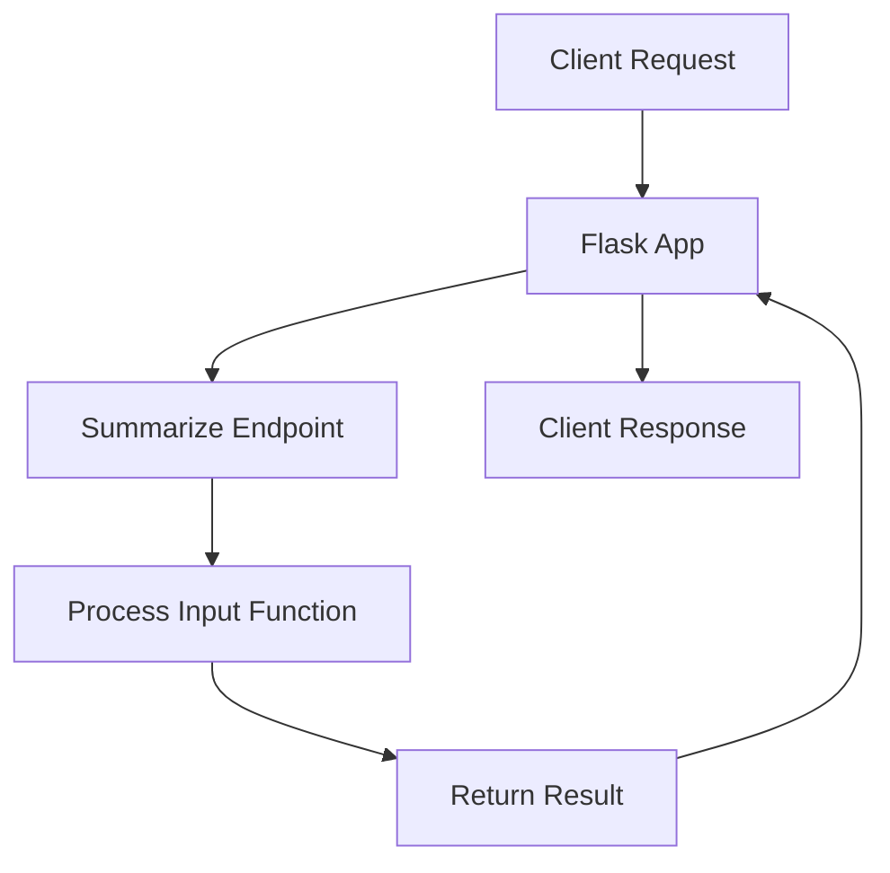

# server.py

> **Source File:** [server.py](https://github.com/Note-Summerizer/blob/main/server.py)  
> **Repository:** `Note-Summerizer`  
> **Branch:** `main`

### Overview
This file implements a Flask web server that provides an API endpoint for processing various types of user input (file uploads, YouTube URLs, microphone audio) to generate summaries or other processed outputs. It acts as the primary interface for client applications interacting with the core processing logic.

### Architecture & Role
Architecturally, `server.py` functions as a backend service API. It resides at the presentation layer, specifically handling incoming HTTP requests. Its role is to receive user input via a RESTful endpoint, delegate the core business logic to the `process_input` function from `lecture4`, and return structured JSON responses to the client. It does not contain the actual summarization logic, but orchestrates its execution based on the request.

### Key Components
*   `app = Flask(__name__)`: The main Flask application instance, serving as the WSGI application.
*   `CORS(app)`: Initializes Cross-Origin Resource Sharing for the Flask application, enabling frontend applications from different origins to make requests.
*   `UPLOAD_FOLDER`: A string constant defining the directory path where uploaded files are temporarily stored.
*   `@app.route('/summarize', methods=['POST'])`: A decorator that registers the `summarize` function as the handler for POST requests to the `/summarize` endpoint.
*   `summarize()`: The core request handler function for the `/summarize` endpoint, responsible for parsing request data, managing file uploads, invoking `process_input`, and formatting the HTTP response.

### Execution Flow / Behavior
1.  When `server.py` is executed, the Flask application (`app`) starts, and `CORS` is enabled. An `uploads` directory is created if it does not already exist.
2.  The application listens for incoming POST requests on the `/summarize` endpoint.
3.  Upon receiving a request, the `summarize` function is invoked:
    *   It extracts `input_type`, `export_format`, `youtube_url`, and `duration` from the request form data.
    *   **If `input_type` is "file"**: The uploaded file is saved temporarily to the `UPLOAD_FOLDER` using `secure_filename`. The `process_input` function from `lecture4` is then called with `source_type="file"` and the temporary file path. After processing, the temporary file is deleted.
    *   **If `input_type` is "youtube"**: The `process_input` function is called with `source_type="youtube"` and the provided `youtube_url`.
    *   **If `input_type` is "mic"**: The `process_input` function is called with `source_type="mic"` and the specified `duration`.
    *   If an invalid `input_type` is provided, a 400 Bad Request error is returned.
    *   The result from `process_input` (expected to be a dictionary) is returned as a JSON response to the client.
4.  Comprehensive `try...except` blocks are used to catch any processing errors. If `process_input` returns an error, or any exception occurs during the request handling, a 500 Internal Server Error is returned with an error message.
5.  When run directly (`if __name__ == '__main__':`), the Flask development server starts in debug mode.

### Dependencies
*   `flask`: The web framework used to build the server, handle routing, requests, and responses.
*   `flask_cors.CORS`: A Flask extension that provides a decorator for enabling Cross-Origin Resource Sharing on routes or globally for the application.
*   `lecture4.process_input`: An internal dependency. This function encapsulates the core business logic for processing different input sources (files, YouTube, microphone) and generating the desired output, abstracting it from the web server layer.
*   `os`: Python's standard operating system interface module, used for creating directories (`makedirs`), joining file paths (`path.join`), and removing temporary files (`remove`).
*   `werkzeug.utils.secure_filename`: A utility function from Werkzeug (a core dependency of Flask) used to sanitize filenames submitted by users to prevent potential security issues like directory traversal.

### Design Notes
*   **Separation of Concerns**: The server acts as a thin API layer, primarily concerned with request handling, input acquisition, and response formatting. The actual data processing and business logic are delegated to the `process_input` function in `lecture4`, promoting modularity.
*   **Temporary File Management**: Uploaded files are saved temporarily to a designated `UPLOAD_FOLDER` and explicitly deleted after processing. This prevents file accumulation but means there is no persistent storage of user uploads.
*   **Error Handling**: Basic `try...except` blocks and checks for error keys in `process_input` results provide a robust, albeit general, error response mechanism.
*   **CORS Enabled**: The `flask_cors` extension is used to enable CORS globally, making the API accessible from different client origins, which is standard for many modern web services.
*   **Input Routing**: The `summarize` endpoint intelligently routes requests to the appropriate `process_input` call based on the `input_type` parameter, simplifying the client-side interaction.
*   **Development vs. Production**: The `app.run(debug=True)` configuration is suitable for development. For production deployments, a WSGI server (e.g., Gunicorn, uWSGI) would be required, and debug mode should be disabled.

### Diagram (Optional)
