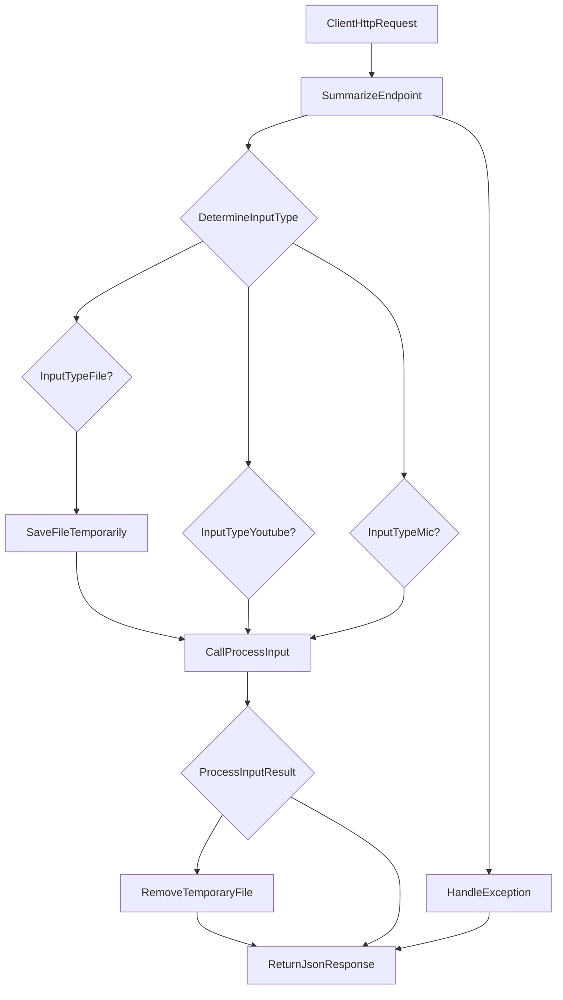

# server.py

> **Source File:** [server.py](https://github.com/test-company-prowiz/Note-Summerizer/blob/main/server.py)
> **Repository:** `Note-Summerizer`
> **Branch:** `main`

# server.py

### Overview
This file implements a Flask web server that exposes a `/summarize` API endpoint. It serves as the entry point for clients to request summarization services by providing different input types, such as uploaded files, YouTube URLs, or microphone audio.

### Architecture & Role
`server.py` acts as the backend's API layer. It receives HTTP requests, processes input parameters, coordinates with an internal `process_input` function (from `lecture4`) for the core business logic, and returns structured JSON responses. It operates as the "controller" in a typical MVC-like architecture, handling client communication and orchestrating underlying services.

### Key Components
*   `app`: The Flask application instance, serving as the WSGI application.
*   `CORS(app)`: Integrates Flask-CORS to enable Cross-Origin Resource Sharing, allowing requests from different origins.
*   `UPLOAD_FOLDER`: A string constant specifying the directory (`"uploads"`) where temporary files are stored for processing.
*   `summarize()`: The main route handler for the `/summarize` POST endpoint. It manages request parsing, delegates to `process_input`, handles file operations, and formats responses.
*   `process_input`: An imported function from `lecture4`, responsible for the core summarization logic based on the provided source type and parameters.
*   `secure_filename`: A utility from `werkzeug.utils` used to sanitize filenames before saving them to the server's file system.

### Execution Flow / Behavior
1.  **Server Initialization**: Upon execution, the Flask `app` is initialized, CORS is enabled, and the `UPLOAD_FOLDER` directory is created if it does not already exist.
2.  **Request Reception**: A POST request to the `/summarize` endpoint is received by the `summarize()` function.
3.  **Parameter Parsing**: The function extracts `input_type`, `export_format`, `youtube_url`, and `duration` from the request form data.
4.  **Input Type Handling**:
    *   **"file"**: If `input_type` is "file" and a file is present in the request, the file is saved temporarily to `UPLOAD_FOLDER` after its filename is secured. `process_input` is then called with `source_type="file"` and the `file_path`. The temporary file is subsequently removed.
    *   **"youtube"**: If `input_type` is "youtube", `process_input` is called with `source_type="youtube"` and the provided `youtube_url`.
    *   **"mic"**: If `input_type` is "mic", `process_input` is called with `source_type="mic"` and the specified `duration`.
    *   **Invalid**: For any other `input_type`, a 400 Bad Request error is returned.
5.  **Result and Error Handling**:
    *   The result from `process_input` is checked for an "error" key. If present, a 500 Internal Server Error is returned with the error details.
    *   If no error, the result is returned as a JSON response with a 200 OK status.
    *   A global exception handler catches any unforeseen errors during the request processing and returns a 500 status with the exception message.
6.  **Server Startup**: When `server.py` is run directly (`if __name__ == '__main__':`), the Flask development server starts in debug mode on the default port.

### Dependencies
*   **flask**: The web framework for building the API.
*   **flask_cors**: An extension for Flask to handle Cross-Origin Resource Sharing (CORS) requests.
*   **lecture4**: An internal module providing the `process_input` function, which encapsulates the core summarization logic. This is a critical business logic dependency.
*   **os**: Python's standard library module for interacting with the operating system, used for file path manipulation and directory creation/deletion.
*   **werkzeug.utils.secure_filename**: A utility function from Werkzeug (a dependency of Flask) used to sanitize filenames, preventing directory traversal vulnerabilities.

### Design Notes
*   **Temporary File Management**: The server handles temporary file uploads by saving them, processing, and then explicitly deleting them. This is crucial for resource management and security.
*   **Input Flexibility**: The API supports multiple input sources (file, YouTube, microphone), abstracting the complexity through a single endpoint and the `process_input` function.
*   **Error Reporting**: The API provides basic error reporting, returning JSON objects with an "error" key for both internal processing errors and general exceptions.
*   **CORS Enabled**: CORS is enabled by default, facilitating integration with client-side applications hosted on different domains during development or in a decoupled architecture.
*   **Development Mode**: The `app.run(debug=True)` setting indicates that the server is configured for a development environment, providing detailed error messages and automatic reloading. For production, `debug` should be `False`, and a production-ready WSGI server should be used.

### Diagram

```mermaid
graph TD
A[ClientHttpRequest] --> B[SummarizeEndpoint]
B --> C{DetermineInputType}
C --> D1{InputTypeFile?}
C --> D2{InputTypeYoutube?}
C --> D3{InputTypeMic?}
D1 --> E1[SaveFileTemporarily]
E1 --> F[CallProcessInput]
D2 --> F[CallProcessInput]
D3 --> F[CallProcessInput]
F --> G{ProcessInputResult}
G --> H1[RemoveTemporaryFile]
H1 --> I[ReturnJsonResponse]
G --> I[ReturnJsonResponse]
B --> J[HandleException]
J --> I[ReturnJsonResponse]
```