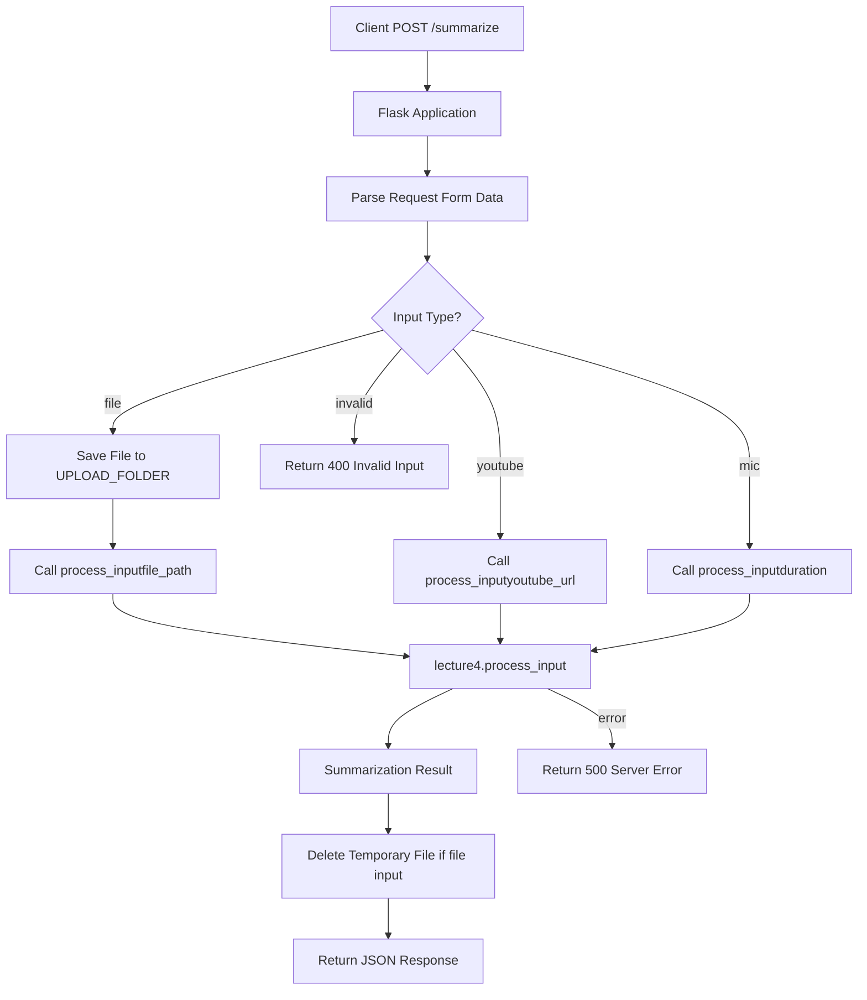

# server.py

> **Source File:** [server.py](https://github.com/test-company-prowiz/Note-Summerizer/blob/main/server.py)
> **Repository:** `Note-Summerizer`
> **Branch:** `main`

# server.py

### Overview
This file implements a Flask web server that exposes a `/summarize` API endpoint. Its primary purpose is to receive summarization requests, handle different input sources (file upload, YouTube URL, microphone input), and delegate the core processing to an external module.

### Architecture & Role
This file acts as the API layer and the entry point for client requests in a client-server architecture. It sits at the application's edge, receiving HTTP requests and orchestrating the necessary steps to fulfill summarization tasks, effectively serving as a thin wrapper around the core summarization logic.

### Key Components
*   **`app = Flask(__name__)`**: The main Flask application instance, serving as the web server.
*   **`CORS(app)`**: Enables Cross-Origin Resource Sharing for the Flask application, allowing requests from different origins.
*   **`UPLOAD_FOLDER`**: A string constant defining the directory for temporary file uploads.
*   **`summarize()`**: The Flask route handler function for the `/summarize` POST endpoint, responsible for processing incoming summarization requests.
*   **`process_input`**: An imported function from `lecture4` that encapsulates the core summarization logic for various input types.

### Execution Flow / Behavior
When a POST request is made to `/summarize`:
1.  The `summarize` function extracts `input_type`, `export_format`, `youtube_url`, and `duration` from the request form data.
2.  It conditionally processes the request based on `input_type`:
    *   If `input_type` is "file", it saves the uploaded file securely to `UPLOAD_FOLDER`, calls `process_input` with the file path, and then deletes the temporary file.
    *   If `input_type` is "youtube", it calls `process_input` with the provided YouTube URL.
    *   If `input_type` is "mic", it calls `process_input` with the specified duration.
    *   If `input_type` is invalid, it returns a 400 error.
3.  The result from `process_input` is checked for errors. If an error is present, a 500 status code is returned.
4.  Otherwise, the result is returned as a JSON response with a 200 status code.
5.  A global exception handler catches any other errors during processing and returns a 500 status code with an error message.
6.  When executed as the main script, the Flask application runs in debug mode.

### Dependencies
*   **`flask`**: Provides the web framework for building the API server.
*   **`flask_cors.CORS`**: Enables cross-origin requests, necessary for client-side applications hosted on different domains.
*   **`lecture4.process_input`**: An internal dependency that contains the business logic for processing and summarizing different input types. This separation ensures the server file remains focused on API handling.
*   **`os`**: Used for operating system interactions, specifically creating the `uploads` directory and deleting temporary files.
*   **`werkzeug.utils.secure_filename`**: Utilized to sanitize filenames provided by clients, preventing directory traversal vulnerabilities.

### Design Notes
The server employs a clear separation of concerns, with `server.py` handling HTTP requests and `lecture4.process_input` managing the core summarization logic. This enhances maintainability and testability. Temporary file uploads are handled by saving files to a dedicated `uploads` directory and immediately deleting them after processing, which is crucial for resource management and security. Error handling is centralized within the `summarize` endpoint, returning standardized JSON error responses.

### Diagram

```mermaid
graph TD
ClientRequest[Client POST /summarize] --> FlaskApp[Flask Application]
FlaskApp --> RequestParsing[Parse Request Form Data]
RequestParsing --> InputTypeCheck{Input Type?}
InputTypeCheck -- file --> FileUpload[Save File to UPLOAD_FOLDER]
FileUpload --> CallProcessInputFile[Call process_inputfile_path]
InputTypeCheck -- youtube --> CallProcessInputYouTube[Call process_inputyoutube_url]
InputTypeCheck -- mic --> CallProcessInputMic[Call process_inputduration]
CallProcessInputFile --> SummarizationLogic[lecture4.process_input]
CallProcessInputYouTube --> SummarizationLogic
CallProcessInputMic --> SummarizationLogic
SummarizationLogic --> Result[Summarization Result]
Result --> DeleteTempFile[Delete Temporary File if file input]
DeleteTempFile --> SendResponse[Return JSON Response]
InputTypeCheck -- invalid --> InvalidInputError[Return 400 Invalid Input]
SummarizationLogic -- error --> ServerError[Return 500 Server Error]
```