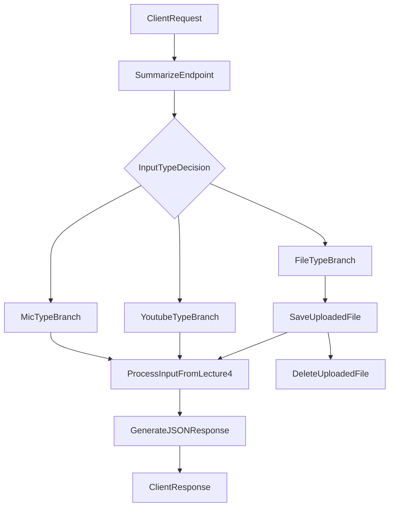

# server.py

> **Source File:** [server.py](https://github.com/test-company-prowiz/Note-Summerizer/blob/main/server.py)
> **Repository:** `Note-Summerizer`
> **Branch:** `main`

# server.py

### Overview
This file implements the primary backend API server using Flask. It exposes a `/summarize` endpoint to handle requests for processing various input types (file, YouTube URL, microphone input) and returning summarized results in a specified format.

### Architecture & Role
This file acts as the API gateway layer within the system's backend. It is responsible for receiving HTTP requests, validating inputs, managing temporary file uploads, and orchestrating the call to the core processing logic, which resides in the `lecture4` module.

### Key Components
*   `app = Flask(__name__)`: The main Flask application instance.
*   `CORS(app)`: Enables Cross-Origin Resource Sharing for the Flask application.
*   `UPLOAD_FOLDER`: A string constant defining the directory for temporary file uploads.
*   `summarize()`: The handler function for the `/summarize` POST endpoint, responsible for request parsing, input type detection, invoking `process_input`, and response generation.

### Execution Flow / Behavior
When the `server.py` script is executed, it initializes a Flask web server on `debug` mode.
1.  The `UPLOAD_FOLDER` directory is created if it doesn't exist.
2.  Upon receiving a `POST` request to `/summarize`:
    *   It extracts `input_type`, `export_format`, `youtube_url`, and `duration` from the request form data.
    *   If `input_type` is "file", it saves the uploaded file securely to `UPLOAD_FOLDER`, calls `process_input` with the file path, and then deletes the temporary file.
    *   If `input_type` is "youtube", it calls `process_input` with the provided YouTube URL.
    *   If `input_type` is "mic", it calls `process_input` with the specified duration.
    *   For invalid `input_type` or if `process_input` returns an error, an appropriate JSON error response is returned.
    *   Otherwise, the JSON result from `process_input` is returned.
3.  Any unhandled exceptions during request processing are caught and returned as a 500 internal server error JSON response.

### Dependencies
*   `flask`: The web framework used to build the API server.
*   `flask_cors`: Provides mechanisms to enable Cross-Origin Resource Sharing.
*   `lecture4.process_input`: An internal dependency that encapsulates the core business logic for processing different input sources and generating summaries.
*   `os`: Standard library module for interacting with the operating system, used for directory creation and file path manipulation.
*   `werkzeug.utils.secure_filename`: Used to sanitize filenames for security before saving uploaded files to prevent directory traversal attacks.

### Design Notes
*   The server uses Flask to provide a straightforward RESTful API endpoint.
*   CORS is enabled by default, which is suitable for development and allows frontend applications from different origins to consume the API. In production, this might be configured more restrictively.
*   Temporary file uploads are handled by saving to a local `uploads` directory and immediately deleting the file after processing, minimizing disk usage.
*   Error handling returns structured JSON responses, which is a standard practice for APIs.
*   Running in `debug=True` mode is convenient for development but should be disabled in production environments for security and performance.

### Diagram

```mermaid
graph TD
A[ClientRequest] --> B[SummarizeEndpoint]
B[SummarizeEndpoint] --> C{InputTypeDecision}
C --> D1[FileTypeBranch]
C --> D2[YoutubeTypeBranch]
C --> D3[MicTypeBranch]
D1 --> E[SaveUploadedFile]
E --> F[ProcessInputFromLecture4]
D2 --> F[ProcessInputFromLecture4]
D3 --> F[ProcessInputFromLecture4]
F --> G[GenerateJSONResponse]
E --> H[DeleteUploadedFile]
G --> I[ClientResponse]
```