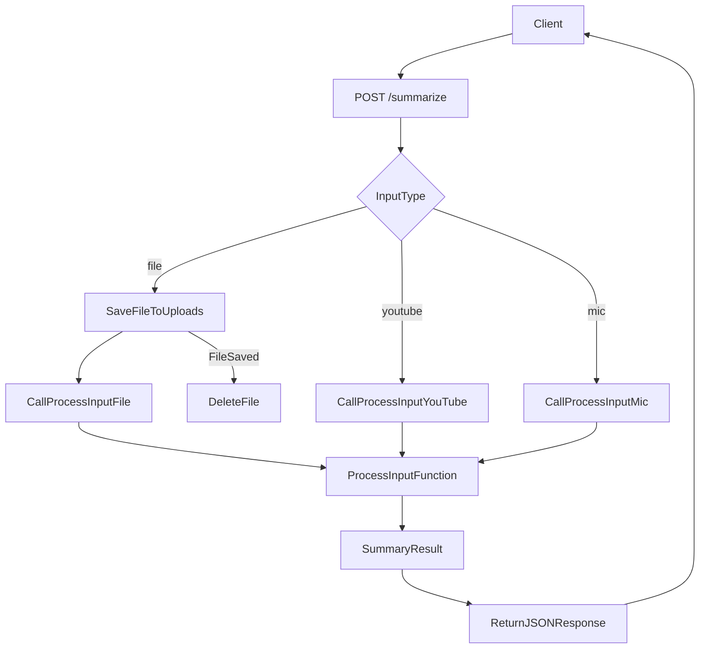

# server.py

> **Source File:** [server.py](https://github.com/test-company-prowiz/Note-Summerizer/blob/main/server.py)
> **Repository:** `Note-Summerizer`
> **Branch:** `main`

# server.py

### Overview
This file implements a Flask web server that provides an API endpoint for processing and summarizing content from various sources. It acts as the primary interface for client applications to request content summarization.

### Architecture & Role
This file serves as the backend's API layer. It defines the public-facing HTTP endpoint and handles incoming requests, request parsing, and response formatting. It sits above the core processing logic, delegating actual summarization tasks to an internal module.

### Key Components
*   **`app = Flask(__name__)`**: The main Flask application instance, responsible for routing HTTP requests.
*   **`CORS(app)`**: Configures Cross-Origin Resource Sharing for the Flask application, allowing requests from different origins.
*   **`UPLOAD_FOLDER = "uploads"`**: Specifies the directory for temporarily storing uploaded files.
*   **`summarize()`**: A Flask route function bound to `/summarize` that handles POST requests for content summarization. It orchestrates input parsing, delegation to `process_input`, and response generation.
*   **`process_input` (from `lecture4`)**: An imported function that encapsulates the core business logic for processing different input types (file, YouTube, microphone) and generating summaries.

### Execution Flow / Behavior
When the `server.py` script is executed, it starts a Flask development server.
1.  A client sends a POST request to the `/summarize` endpoint.
2.  The `summarize` function extracts parameters like `input_type`, `export_format`, `youtube_url`, and `duration` from the request form data.
3.  Based on the `input_type`:
    *   If "file", it securely saves the uploaded file to `UPLOAD_FOLDER`, calls `process_input` with `source_type="file"` and the file path, then deletes the temporary file.
    *   If "youtube", it calls `process_input` with `source_type="youtube"` and the provided YouTube URL.
    *   If "mic", it calls `process_input` with `source_type="mic"` and the specified duration.
    *   If `input_type` is invalid, it returns a 400 Bad Request error.
4.  The result from `process_input` is then returned to the client as a JSON response.
5.  Comprehensive error handling is in place to catch exceptions during processing and return a 500 Internal Server Error.

### Dependencies
*   **`flask`**: Provides the web framework for building the API, handling requests, and sending responses.
*   **`flask_cors`**: Enables Cross-Origin Resource Sharing, crucial for frontend applications deployed on different domains.
*   **`lecture4.process_input`**: This is a critical internal dependency, abstracting the core logic for content ingestion and summarization.
*   **`os`**: Used for interacting with the operating system, specifically for creating the `UPLOAD_FOLDER` and managing uploaded files (saving and deleting).
*   **`werkzeug.utils.secure_filename`**: Essential for sanitizing filenames from user uploads to prevent directory traversal vulnerabilities and ensure file system safety.

### Design Notes
The server is designed to be a thin API layer, primarily responsible for request handling, input validation, and delegation to a separate processing module (`lecture4`). This separation of concerns allows the core summarization logic to evolve independently. File uploads are handled securely by `secure_filename` and are immediately deleted after processing to minimize storage footprint and potential data retention issues. The API provides clear JSON responses, including error messages, facilitating client-side integration.

### Diagram

```mermaid
graph TD
A[Client] --> B[POST /summarize]
B --> C{InputType}
C -- file --> D[SaveFileToUploads]
D --> E[CallProcessInputFile]
C -- youtube --> F[CallProcessInputYouTube]
C -- mic --> G[CallProcessInputMic]
E --> H[ProcessInputFunction]
F --> H
G --> H
H --> I[SummaryResult]
I --> J[ReturnJSONResponse]
D -- FileSaved --> K[DeleteFile]
J --> A
```