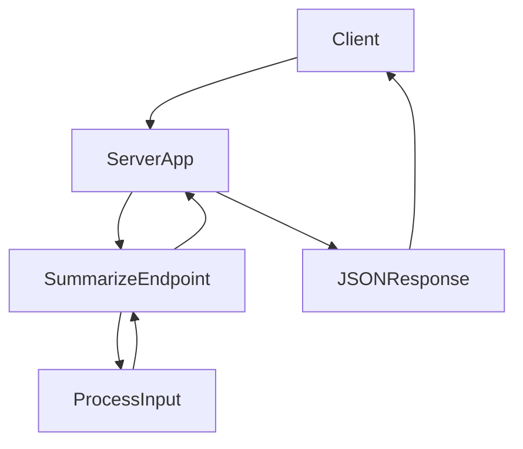

# server.py

> **Source File:** [server.py](https://github.com/test-company-prowiz/Note-Summerizer/blob/main/server.py)
> **Repository:** `Note-Summerizer`
> **Branch:** `main`

# server.py

### Overview
This file implements a Flask web server that provides an API endpoint for content summarization. It handles incoming HTTP POST requests, processes different input sources (file uploads, YouTube URLs, microphone input), and orchestrates the summarization logic by invoking an external module.

### Architecture & Role
`server.py` functions as the backend's API gateway and application layer. It acts as the primary interface for client applications to access summarization services. It receives requests from the presentation layer (e.g., a web frontend), dispatches them to the core business logic (`lecture4` module), and returns structured responses.

### Key Components
*   `app = Flask(__name__)`: The main Flask application instance, responsible for routing HTTP requests.
*   `CORS(app)`: Initializes Cross-Origin Resource Sharing, allowing frontend applications from different origins to interact with the API.
*   `UPLOAD_FOLDER`: A string constant defining the directory for temporary file storage during file uploads.
*   `summarize()`: The API endpoint function mapped to the `/summarize` route, handling the request parsing, input type detection, and invocation of the `process_input` function.
*   `process_input()`: An imported function from the `lecture4` module, responsible for executing the core summarization logic based on the provided source type and parameters.

### Execution Flow / Behavior
1.  When `server.py` is executed, it initializes a Flask application and starts listening for incoming HTTP requests on `debug=True` mode (port 5000 by default).
2.  A client sends an HTTP POST request to the `/summarize` endpoint.
3.  The `summarize` function extracts `input_type`, `export_format`, `youtube_url`, and `duration` from the request form data.
4.  Based on the `input_type`:
    *   If `file`: The uploaded file is securely saved to the `UPLOAD_FOLDER`, `process_input` is called with `source_type="file"` and the file path, and the temporary file is then removed.
    *   If `youtube`: `process_input` is called with `source_type="youtube"` and the provided URL.
    *   If `mic`: `process_input` is called with `source_type="mic"` and the specified duration.
    *   If `input_type` is invalid, a 400 error is returned.
5.  The result from `process_input` is checked for errors. If an error is present, a 500 status code is returned.
6.  The processed result (or error) is returned to the client as a JSON response.
7.  A `try-except` block handles any unexpected exceptions during request processing, returning a generic 500 error.

### Dependencies
*   **`flask`**: The web framework used to build the API.
*   **`flask_cors`**: Enables Cross-Origin Resource Sharing, crucial for frontend-backend communication in different environments.
*   **`lecture4.process_input`**: An internal dependency providing the core business logic for processing various input sources and generating summaries.
*   **`os`**: Used for operating system interactions, specifically creating the upload directory and deleting temporary files.
*   **`werkzeug.utils.secure_filename`**: A utility function to sanitize filenames, preventing directory traversal vulnerabilities during file uploads.

### Design Notes
*   **Temporary File Handling**: Uploaded files are saved to a local `UPLOAD_FOLDER` temporarily and deleted immediately after processing. This minimizes disk usage and potential security risks.
*   **Security for File Uploads**: `secure_filename` is employed to sanitize uploaded filenames, mitigating risks associated with malicious file paths.
*   **CORS Enabled**: The `flask_cors` extension is used to allow cross-origin requests, which is standard for modern web applications where the frontend and backend often reside on different domains or ports.
*   **Centralized Error Handling**: A top-level `try-except` block in the `summarize` function catches general exceptions, providing a consistent error response format.
*   **Development Mode**: The `app.run(debug=True)` configuration is suitable for development but should be disabled (`debug=False`) or replaced with a production-grade WSGI server (e.g., Gunicorn, uWSGI) for deployment.

### Diagram

```mermaid
graph TD
A[Client] --> B[ServerApp]
B --> C[SummarizeEndpoint]
C --> D[ProcessInput]
D --> C
C --> B
B --> E[JSONResponse]
E --> A
```