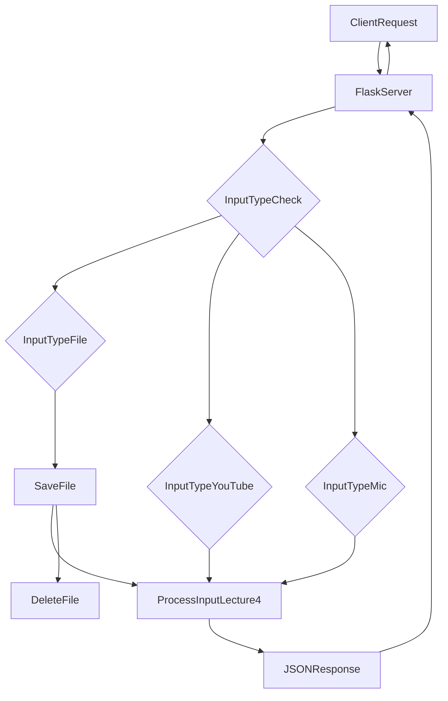

# server.py

> **Source File:** [server.py](https://github.com/test-company-prowiz/Note-Summerizer/blob/main/server.py)
> **Repository:** `Note-Summerizer`
> **Branch:** `main`

# server.py

### Overview
This file implements a Flask web server that exposes a `/summarize` API endpoint. Its primary function is to receive summarization requests, handle various input sources (file uploads, YouTube URLs, microphone input), and delegate the core processing to the `process_input` function from the `lecture4` module.

### Architecture & Role
This file acts as the API gateway and the application layer's entry point for the summarization service. It sits at the interface between the client-side application and the backend business logic (defined in `lecture4`), handling HTTP requests, input validation, and response formatting.

### Key Components
*   **`app = Flask(__name__)`**: The main Flask application instance, responsible for routing HTTP requests.
*   **`CORS(app)`**: Configures Cross-Origin Resource Sharing for the Flask application, allowing requests from different origins.
*   **`UPLOAD_FOLDER`**: A constant defining the local directory where uploaded files are temporarily stored.
*   **`/summarize` Endpoint**: A POST route (`@app.route('/summarize', methods=['POST'])`) that processes summarization requests.
*   **`summarize()` function**: The handler for the `/summarize` endpoint, responsible for parsing request data, managing file uploads, invoking `process_input`, and returning JSON responses.

### Execution Flow / Behavior
1.  Upon server startup, the Flask application is initialized, CORS is configured, and the `uploads` directory is created if it doesn't exist.
2.  When a client sends an HTTP POST request to `/summarize`:
    *   The request body is parsed to extract `input_type`, `export_format`, `youtube_url`, and `duration`.
    *   **If `input_type` is "file"**: The uploaded file is securely saved to the `UPLOAD_FOLDER`, `process_input` is called with the file path, and the temporary file is deleted.
    *   **If `input_type` is "youtube"**: `process_input` is called with the provided YouTube URL.
    *   **If `input_type` is "mic"**: `process_input` is called with the specified duration.
    *   **For invalid `input_type`**: A 400 Bad Request error is returned.
    *   The result from `process_input` is returned as a JSON response.
    *   Any exceptions during this process are caught, and a 500 Internal Server Error JSON response is returned.
3.  If the script is executed directly (`if __name__ == '__main__':`), the Flask development server starts in debug mode.

### Dependencies
*   **`flask`**: Provides the web framework for building the API.
*   **`flask_cors`**: Enables Cross-Origin Resource Sharing for the API, allowing frontend applications from different domains to interact with it.
*   **`lecture4.process_input`**: An internal dependency providing the core business logic for processing and summarizing various input types.
*   **`os`**: Used for file system operations, specifically creating the upload directory (`os.makedirs`), joining file paths (`os.path.join`), and deleting temporary files (`os.remove`).
*   **`werkzeug.utils.secure_filename`**: Utilized to sanitize filenames provided by users, preventing directory traversal vulnerabilities during file uploads.

### Design Notes
The design separates the web-facing API layer from the core summarization logic, which resides in `lecture4.py`. This promotes modularity. The temporary file handling for uploads (save then remove) ensures that server storage is not permanently consumed by user-uploaded content. The use of `debug=True` in `app.run()` is suitable for development but should be disabled or managed differently in a production environment for security and performance reasons. Error handling is implemented to provide informative JSON responses for both client-side and server-side issues.

### Diagram

```mermaid
graph TD
A[ClientRequest] --> B[FlaskServer]
B --> C{InputTypeCheck}
C --> D1{InputTypeFile}
D1 --> E1[SaveFile]
E1 --> F[ProcessInputLecture4]
E1 --> G[DeleteFile]
C --> D2{InputTypeYouTube}
D2 --> F
C --> D3{InputTypeMic}
D3 --> F
F --> H[JSONResponse]
H --> B
B --> A
```