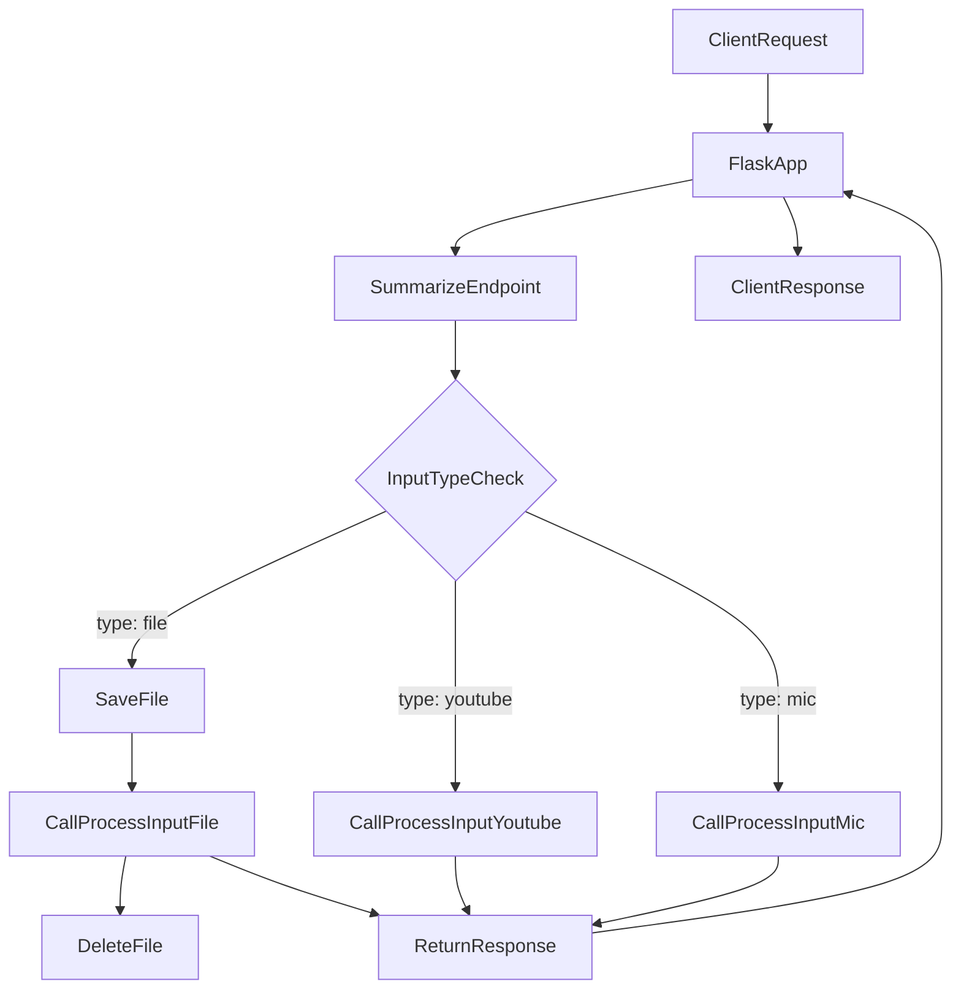

# server.py

> **Source File:** [server.py](https://github.com/test-company-prowiz/Note-Summerizer/blob/main/server.py)
> **Repository:** `Note-Summerizer`
> **Branch:** `main`

# server.py

### Overview
This file implements a Flask web server that exposes a single API endpoint for processing various input types (file, YouTube URL, microphone input) and generating summaries. It acts as the primary interface for client applications to interact with the summarization logic.

### Architecture & Role
This file functions as the backend API layer within the system. It is responsible for handling incoming HTTP requests, orchestrating the processing of inputs, and returning structured JSON responses. It sits at the edge of the application, receiving requests from the client and delegating core logic to internal modules like `lecture4`.

### Key Components
-   `app`: The Flask application instance, serving as the WSGI application.
-   `CORS(app)`: Initializes Cross-Origin Resource Sharing, allowing client-side requests from different origins.
-   `UPLOAD_FOLDER`: A string constant defining the directory for temporary file uploads.
-   `summarize()`: The route handler function for the `/summarize` POST endpoint. It parses request data, manages file uploads, invokes the `process_input` function, and handles responses and errors.

### Execution Flow / Behavior
1.  A client sends an HTTP POST request to the `/summarize` endpoint.
2.  The `summarize` function extracts `input_type`, `export_format`, `youtube_url`, and `duration` from the request form data.
3.  Based on `input_type`:
    *   **"file"**: The uploaded file is securely saved to the `UPLOAD_FOLDER`, `process_input` is called with the file path, and the temporary file is subsequently removed.
    *   **"youtube"**: `process_input` is called with the provided `youtube_url`.
    *   **"mic"**: `process_input` is called with the specified `duration`.
    *   **Invalid**: Returns a 400 error.
4.  The `process_input` function (imported from `lecture4`) executes the core summarization logic.
5.  The result from `process_input` is checked for errors. If an error is present, a 500 status code is returned.
6.  A JSON response containing the summarization result or an error message is returned to the client.
7.  Global exception handling catches any unexpected errors during processing and returns a 500 status code with an error message.
8.  When executed directly (`if __name__ == '__main__':`), the Flask app runs in debug mode on a local server.

### Dependencies
-   `flask`: Web framework for building the API.
-   `flask_cors.CORS`: Enables Cross-Origin Resource Sharing for the Flask application.
-   `lecture4.process_input`: An internal dependency providing the core business logic for processing various input types and generating summaries.
-   `os`: Standard library module used for interacting with the operating system, specifically for creating the `UPLOAD_FOLDER` and managing temporary files.
-   `werkzeug.utils.secure_filename`: Used to sanitize filenames for security before saving uploaded files to prevent directory traversal attacks.

### Design Notes
-   The use of `UPLOAD_FOLDER` and `os.remove(filepath)` demonstrates a pattern for handling temporary file uploads, ensuring cleanup after processing.
-   Error handling is implemented with `try...except` blocks, returning JSON error messages and appropriate HTTP status codes (400 for bad requests, 500 for server errors).
-   `CORS` is enabled globally for the application, simplifying frontend integration but potentially requiring more granular control in a production environment.
-   The API design centralizes different input types under a single `/summarize` endpoint, using the `input_type` parameter for differentiation. This keeps the API surface small but delegates type-specific logic to the `process_input` function.

### Diagram

```mermaid
graph TD
A[ClientRequest] --> B[FlaskApp]
B --> C[SummarizeEndpoint]
C --> D{InputTypeCheck}
D -- "type: file" --> E[SaveFile]
E --> F[CallProcessInputFile]
F --> G[DeleteFile]
D -- "type: youtube" --> H[CallProcessInputYoutube]
D -- "type: mic" --> I[CallProcessInputMic]
F --> J[ReturnResponse]
H --> J
I --> J
J --> B
B --> K[ClientResponse]
```