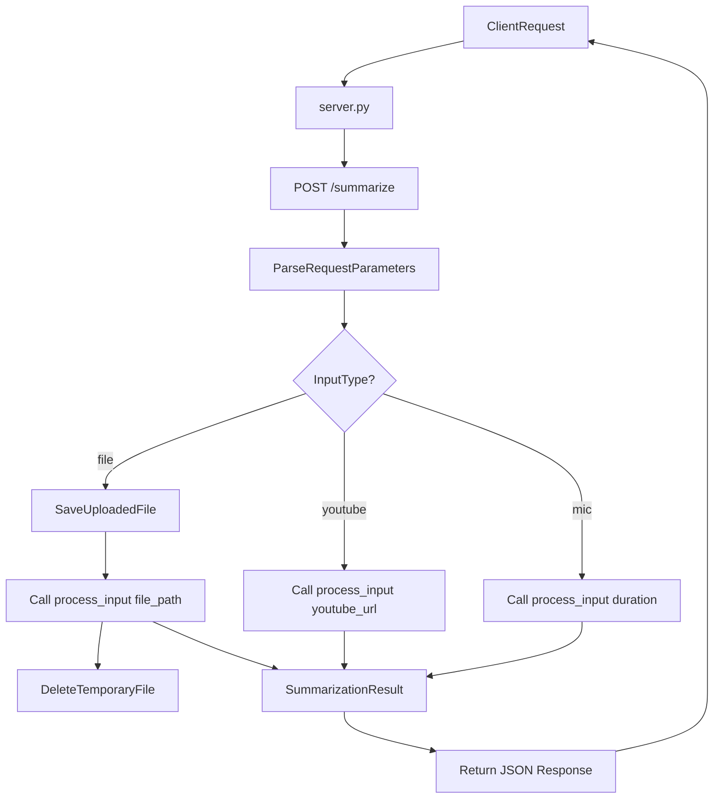

# server.py

> **Source File:** [server.py](https://github.com/test-company-prowiz/Note-Summerizer/blob/main/server.py)
> **Repository:** `Note-Summerizer`
> **Branch:** `main`

# server.py

### Overview
This file implements a Flask web server that exposes an API endpoint for processing and summarizing various input types. It acts as the backend service responsible for receiving client requests, orchestrating data input, and returning processed results.

### Architecture & Role
This file functions as the API layer within the system's backend. It is responsible for handling incoming HTTP requests, routing them to the appropriate processing logic, and managing server-side interactions like file uploads. It operates at the presentation layer for the core summarization functionality.

### Key Components
*   **`app = Flask(__name__)`**: The main Flask application instance, serving as the entry point for web requests.
*   **`CORS(app)`**: Configures Cross-Origin Resource Sharing for the Flask application, allowing requests from different domains.
*   **`UPLOAD_FOLDER = "uploads"`**: Defines the directory for temporary storage of uploaded files.
*   **`/summarize` endpoint**: A POST route that serves as the primary API for initiating summarization tasks.
*   **`summarize()` function**: The handler for the `/summarize` endpoint, parsing request parameters and invoking the core processing logic.
*   **`process_input` (from `lecture4`)**: An external function responsible for the actual summarization based on source type and format.

### Execution Flow / Behavior
1.  The Flask application `app` is initialized and CORS is enabled.
2.  A directory named `uploads` is created if it doesn't already exist, to store temporary files.
3.  When a `POST` request is received at the `/summarize` endpoint:
    *   The `summarize` function extracts `input_type`, `export_format`, `youtube_url`, and `duration` from the request form data.
    *   Based on `input_type`:
        *   **`file`**: An uploaded file is securely saved to `UPLOAD_FOLDER`, `process_input` is called with the file path, and the file is subsequently removed.
        *   **`youtube`**: `process_input` is called with the provided `youtube_url`.
        *   **`mic`**: `process_input` is called with the specified `duration`.
        *   **Invalid**: Returns a 400 error.
    *   If `process_input` returns an error, a 500 status code is returned with the error message.
    *   Otherwise, the result from `process_input` is returned as a JSON response.
4.  Global exception handling catches unexpected errors during request processing, returning a 500 error.
5.  The application runs in debug mode if executed directly.

### Dependencies
*   **`flask`**: Provides the web framework functionalities, including request handling, routing, and JSON responses.
*   **`flask_cors`**: Integrates CORS support, essential for client-side applications interacting with the API.
*   **`lecture4`**: Contains the core business logic (`process_input`) for summarization. This is a critical internal dependency.
*   **`os`**: Used for interacting with the file system, specifically for creating the upload directory and managing temporary files.
*   **`werkzeug.utils.secure_filename`**: Utilized to sanitize filenames provided by users, preventing directory traversal vulnerabilities.

### Design Notes
The server provides a unified API endpoint `/summarize` to handle multiple input sources, simplifying client interaction. The use of a temporary `UPLOAD_FOLDER` and immediate file deletion for file-based inputs is crucial for resource management and security. Error handling is implemented at both the `process_input` result level and globally for unexpected exceptions. Running in debug mode by default is suitable for development but should be disabled for production environments.

### Diagram

```mermaid
graph TD
ClientRequest[ClientRequest] --> ServerPython[server.py]
ServerPython --> SummarizeEndpoint[POST /summarize]
SummarizeEndpoint --> ParseRequest[ParseRequestParameters]
ParseRequest --> InputTypeBranch{InputType?}

InputTypeBranch --> |file| SaveFile[SaveUploadedFile]
SaveFile --> CallProcessInputFile[Call process_input file_path]
CallProcessInputFile --> DeleteFile[DeleteTemporaryFile]

InputTypeBranch --> |youtube| CallProcessInputYouTube[Call process_input youtube_url]
InputTypeBranch --> |mic| CallProcessInputMic[Call process_input duration]

CallProcessInputFile --> SummarizationResult[SummarizationResult]
CallProcessInputYouTube --> SummarizationResult
CallProcessInputMic --> SummarizationResult

SummarizationResult --> JSONResponse[Return JSON Response]
JSONResponse --> ClientRequest
```